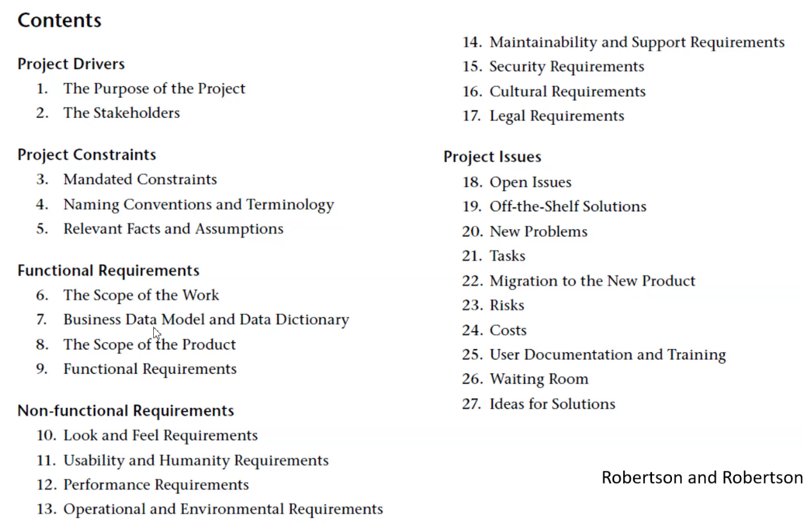
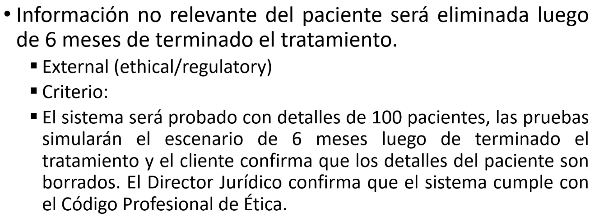

## Software Requerimentos specification template

Cuadro preferido

Robertson and Robertson

>>> Un req de cladiad se refiere a uno no funcional

>>> Funcional que o para que, nada de especificaicon de arq o framwork etc

>>> Especificaicon Tecnica, categorira no fucnoinales desarollo, entorno,

## Caracteristias de requerimientos escritos con cladiad
1. correctos: repsenta algoq ue el sistema dbe cumplir
2. no ambiguo: si y solo puede estar sujeto a una interpretacion
3. entendible: debe utilizar el lenguaje y la cultura del stakeholder y presentar los requerimientos de una forma entendible a los stakeholders y a los desarrolladores
4. completo: un docuemtno de especifiacion de requerimientos esta completo si y solo si describe todos los querimientos de usuario y los requerimientos detallados asociados con la funcion, desempeaño y restricciones.
5. consistente: si ingun req entra en conflicto con algun otro (que lso reqs no se contradigan)
6. factible: evaluar si es tecnicamente posible su implementacion. realizable, presupuestario, planificaicon tiempo
7. priorizados: utilizando atributos del req se debe determinar si debe ser incluido al final de propducto y el orden de inclusion en un proceo de desarrollo iterativo. Segun los pasos:
   - Must: debe ser entregado en esta iteracion
   - Should: se espera que sea entregado
   - coulds: seria bueno que se implemente
   - won'ts: defenitivamente no
8. verificables: se satisface el req, debe verificar lsoc riterios de verificabilidad.
9.  modificable: si los requerimientos pueden ser cambiados y el docuemtnos permanece consistente y completo
10. trazable mecnaismo para rastraer cada req a travs de todoe l dearollo
11. organizados: especificacion de reqs debe ser orgnaizado. lista d econtenido, indice, glosario y un hisotrial de revision. categorizados en grupos de requerimientos. explicito las dpednecias entre los reqs
12. independeintes del diseño: si ningun req en el documento de especificacion de req especifica arquitectura de software o algoritmos

## Caracterisitcas de requemientos escritos con cladiad

Recomendaciones generales
- elimianr terminal imprecisos tales como: alugnos, algunas veces
- elminar etc, tales como
- los rangos deben ser explicitos
- cuando se especifica un calculo, se deben dar la menos dos ejemplos
- eliminar pronombres o sustantivos ambiguos, por ejemplo bandera

## Lineamientos para elaborar requerimientos

- los req de usuarios genenralemte implican verbos tales como proveer, determinar, mejorar, reducir.
- los reqs del sistema implican acciones tales como aceptar, chequear, seleccionar, calcular.
- formalmente defina todos los terminos.
- use la terminologia del dominio del problema.
- nucna use el mismo termino para diferentes cosas
- siempre use el mismo temrino para reiferisse a la misma cosa
- escriba para el lector.
- usar lsita y numeracion de referencia
- sea flexible (no usar un formato o temrica a ley)
- organizar los requermientos apropiadamente, es decir, suuario, hardware, interfaces de software
- provea indice de contneido, referecnias, referencias cruzadas
- tratar de no duplicar requerimientos, defina el requerimiento general y luego especificos
- evitar generalidades como "todos los requemirs deben ser probados"
- referencia otros documentos claramente
- use layout y fuentes consistentemente
- lea lo que usted escribe

## Validacion de req

- validacion de req es el rpcoeso de chequear que los req definen el sistema que el cliente realmente queire.
- chequeaos que deben hacerse:
  - chequeos de validez: refleja la necesidades del sistema dle usuario
  - consistencia: no entre en conflicto
  - completitud: define todas las funciones del sistema del usuario, conocimiento dle sistema a relaizar
  - realismo: verificar que los requerimientos esten dentro del presupuesto y calendario para el sistema, mi conociemito
  - verifiablidad: los requerimientos deben estar escritos, que sean verifiable, criterios de validacion

## Tenicas de vlaidacion

- review de reqerimientos: compartimos los reqs y analizamos inconsistencias
- protoipos: plotea un requerimiento en un prototipo
- casos de prueba: pruebas para verificar el req

## Criterios de validacion o aceptación

Define como el cliente chequeara que los requerimientos ha sido satisfechos:
1. aprobacion de un experto
2. una prueba mediable
   - por un periodo definido de tiempo, o
   - con un numero definido de usuario, o
   - con numero de casos de prueba
3. pruebas de aceptacion de usuario
4. simulacion
5. encuestas de satisfaccion a usuarios

Ejemplos:

## Verifiacion y validacion
verifiacion y validacion no son lo mismo.

- **verificaicon** de software es el procesos de chequear qu eun software cumple con los reqs funcionales y no funcionales. el sistema desarollado cumple con lo escrito en el documentos.  are we building the product right (documento)?
- el objetivo de **validacion** de sfotware, es asegurar que el sistema cumple con las espectativas del cleinte, satisface con el cleinte, va mas alla del docuemto, se enfoca en el usuario. Are we building the right product?

