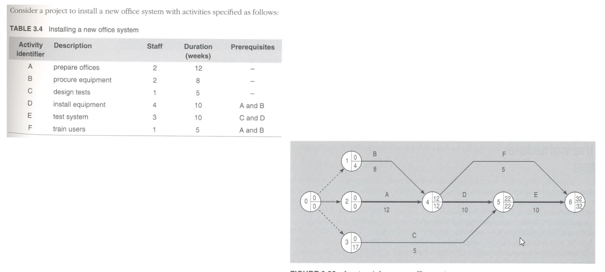
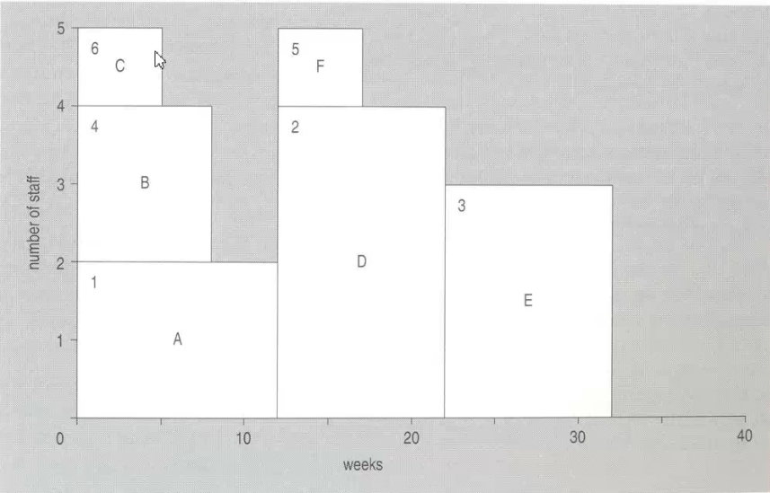
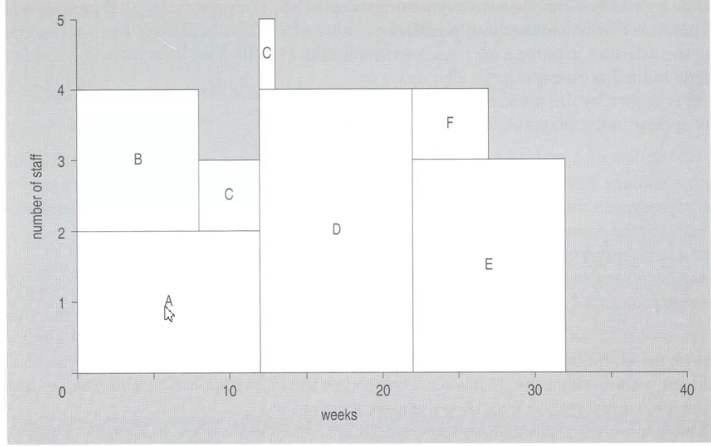
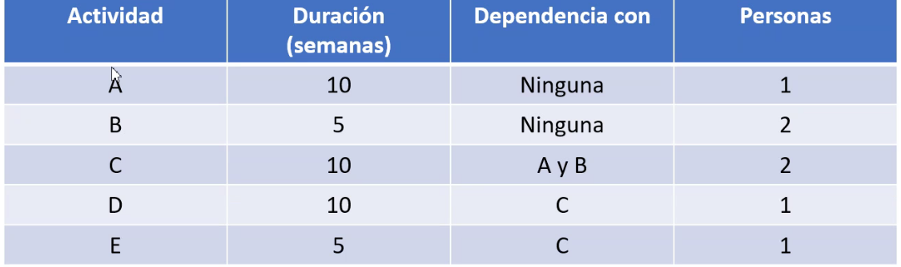

## Proyecto

Es unica aventura con un inicio y un fin, conducido poir personas con un objetivo con paramtetros de costa, agendamiento y calidad. Es un empredimiento finito

Involucra:
- planeacin
- monitoreo
- control de personas, procesos y eventos

Es una parte escencial de ingenira de software

Como saber si es exitosa?
- entrega del software a tiempo
- mantener los costos dentro del prosupuesto
- entregar el software que cumpla con las espectativas del cliente
- mantener una coherencia y buen funcionamiento del equipo de desarrollo

## Desafios de adminsitracion de proyectos de software
- the product is intangible
- generalmente son proyectos unicos
- procesos de software son variables y especificos por organizacion

## Roles

### proyect manager
- planificcion, estimacion, agendamiento y asignacion de personas a las tareas. Supervisa el trabajo y monitorear si vamos a tiempo y dentro del prosupuesto.
- gestion de riesgo: tomar acciones si aparecen
- gestion de las personas: maximizar la productividad organizando a las personas
- reportar: reprotar el progreso del proyecto a los clientes. Tiene que ser capaz de comunicarse con los clientes y el equipo de desarollo. Producir texto coherente, poder extraer la informacion critica
- propuesta: describe los objetivos del proyecto y como lograrlo. esto incluye costo y agendamiento y justificar porque el proyecto deberia se garantizado para una oganizacion o equipos
  
#### Gestion de personas
- consistencia: tratar a todos por igual
- respecto: diferntecias las habilidades de las personas, buscar la manera en que contribuyan
- inclusion: personas contribuyan efectivamente cuando ellos sientan que su opinian es tomada en cuenta. PM tiene que saver escuchar
- honestidad: ser honesto de lo que va bine y lo que va mal. se honesto del conocimiento que tiene y estar habierto cando hay gente que sabe

#### Motivacion de personas
- necesidades de autorealizacion
- necesidades de estima o aprecio
- necesidades sociales
- necesidades securidad
- necesidades fisiologicas

### product owner
representa el negocio o usuarios finales, determina la caracteristicas

### The software architect
highly skilled, escoge las aruqteturas y protocolos

### Developers
equipo d elos miembros que aplican sus conocimientos de ingneira y programacion in el desarollo

### Aseguramiento de la caldiad o Terters
responsable de la calidad y asegurarse de que el producto cumple con los reuqerimientos del negocio, libre de bugs, errores y defetos

## Que son los stakeholders?
Son personas que pueden influir en el reusltado del proyecto. Estamos incluyendo a las personas que pueden obtruir, bloquear  el proyecto, las personas que puedan auspiciar el proyecto

Categorias:
- senior managers: altos directivos de la empresa involucrados en el proyecto
- proyect (technical) managers: los lideres tecnicos
- practitiones: equipo d edesarollo
- customers: quienes especifica los requerimientos para el software para ingneira y otros
- end users: quien interactua con el software una vez que se lanza

## Scheduling
- Elaborar un cronograma
- Es una de los principales actividades de un director de proyecto
- muchas organizaciones de ingenira de software desarollan productos de alta claidad
- muchas organizaciones de ingenieria de software desarollan productos de alta calidad, pero son entregados muy tarde, el tiempo es dinero
- los proyeto con retraso son caros para el cliente

## Fases y milestones
Dividir al proyecto en sus fases, y tambien los milestones, son puntos de termintar de cada fase. Se agrega trabajo sobre un baseline.

Network techinques es reproesentar graficmante la relacion secuancial de las actividades

- que se debe ser antes para inicar esta actvidad?
- que se puede hacer despues una vez que este terminada?
- que activades pueden ser desarrolada en paralelo

## Activity on arrow

- earlist-event-time mas temprano, paso hacia adelante, si hay dos camidos a un nodo se ecoje el que tiene mayor tiempo
- lastest-event-time mas tarde, paos hacia atras, se fija el tiempo maximo y se va restando el lastest-time del nodo con la duracion de la flecha, si hay dos caminods se escoge la resta que dé la menor fecha

## Critial Path

Es la secuencia de activades que no se pueden atrasar, o las que menos, para mantener la fecha del proyecto

- algunas activades podrian incremtnear su duracion y aun asi se cumple con ele tiempo, se dice que esas activades tiene *float*
- Float es el exceso de tiempo disponible en una activades al de su tiempo estimado de duracion
- **Path flaot o total float** es el tiempo que una acitvades se puede expandir o retrasar su inicio y el proyecto aun se cumplira en la fehca establecida.

Calculo de *path float*: 

`Total float = lastest time of finish event - earlist time of start event - duration (units time in the arrow)`

**Por lo que el critial es el float con menos float**. 

## Resources and Scheduling

Se deben assignar los recuross y agendar las actividades no para lo mas pronto posible si no en el momento que se haga un mejor uso de los recursos disponibles, enfocar los recursos

Dos escenarios pisibles:
- el caso de recursos ilimitados en un tiempo de duracion fija para el proyecto: es vital **cumplir con la fecha de entrega**, se puede contratar perosnal adicional, pagar sobretiempo, contratar servicios, rentar instalaciones lo que sea
- el caso de recursos limitados pero en un timepo de proyecto posible: **no se puede contar con mas personal**, ni pagar horas extras, ni contratar mas servicios, las limitaciones pueden demorar la fecha de entrega

### Time-limited Scheduling

Resource-smothing

- red de activades
- se colcoar el staff, duracion, EST, float y LFT
- listar las actividades en orden creciente de float (primero las que son criticas) y luego lst 
- grafique un initial resource loading chart, con cada activades programada a su earliest start time, Esto produce un diagrama con activades mas criticas
- reordenar las activades para nivelar los recursos

El grafico meustra dependencia de activades a lo largo del tiempo (horizontal), las activades mas flotante se colocan arriba

- paraeller scheduling, es un metodo de agendamiento en el cual las activades eligeble son considerasas en paralelos
- serial: la assignacion se define en un orden predefinido, por ejemplo en ordne creciente de flotacion

Reglas:
1. De entre las activades elegible seleccione primero la activad que tiene el earlest date para el latest start time. Si varias activades elegible tiene el mismo latest start time, entocnes la que tenga la menor duracion, si aun hay dos o mas, entonces use otros distintivos como esocger la activades con el mayor requerimiento de recursos
2. Siemrpe continuar con una acitvades que ya ha sido inicada hasta que haya sido completada
3. NUNCA PERMITIR a un recursos estar desocupado si hay una acitvad elegible que pueda ser iniciada
4. **Una acitvidad no puede iniciada solo con recursos parciales**!

## Ejercicios

