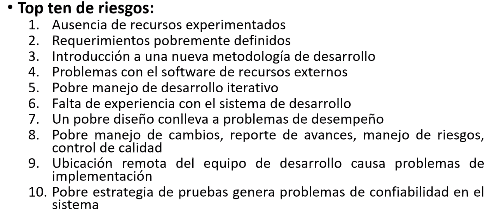
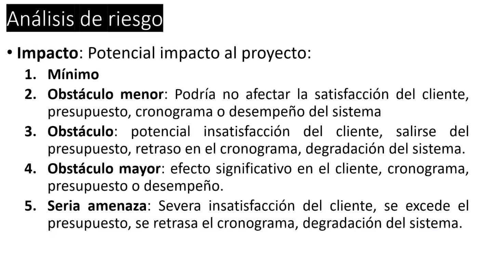
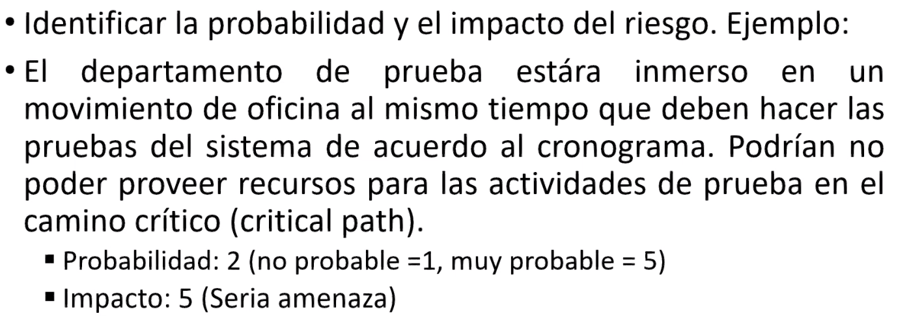

## Identirficacion de riegos

- fuego, desastres
- acciidentes
- politicos y sociales: cambio el contexto politico, social: algo que ya no esta bien visto
- tecnicos: algo que va a hacer obsolte
- de mercado: cometencia, atento a lo que innovan
- laborales
- regulatorios

Lista d chequeo de riegos para proyectos de tencologia

- tamaño del pryecto
- madurez tecnologica (metodo y personas)
- complejidad estructural (organizacion y componetes)

## Categorias documentadas de riegos

- Estrategias / de negocio
  - cuan estable es el area de negocio
  - los objetivos del proyecto estan alieados con la estrategia de negocio de la organizacion
- Factores externos
  - tienen los req alguna implicacion legal?
  - esta el proyecto sujeto a la opinion publica?
- Procurement
  - los criterios de aceptacion estan claros y establecidos?
  - haz utilizado antes este proveedor?
  - estan claramente establecidas las respoinsabildiades concernientes a cambio de requerimientos?
  - es estable el proveedor?
- Facitores organizaciones
  - tiene la org el comprmiso para la gest de riegos?
  - tienen el proyecto apoyo de alto nivel por parte del contratante y del cliente?
- Riegos tecnicos
  - es la especificacion clara, concia, precisa, factible
  - se ha llevado a cabo un estudio de factibilidad
  - como se involucra al cliente durante el proyecto?
  - esta el equipo familiarizado con los metodos y herramientas?
  - cual es el grado de complejidad tecnica?
  - cual es el ciclo de vida (proceso de software) seleccionado para el proyecto

## Top 10 de riesgos

## Identificacion de riegos a nivel de actividad

- Identificar los riegos a nivel de actividad utilizando el WBS (Work breakdown structure)
- User el proceso de una tormmenta de ideas negativa
- Que puede salir mal en esta actividad
- Identificar la causa y el efecto de un riesgo

## Analisis de riegos

