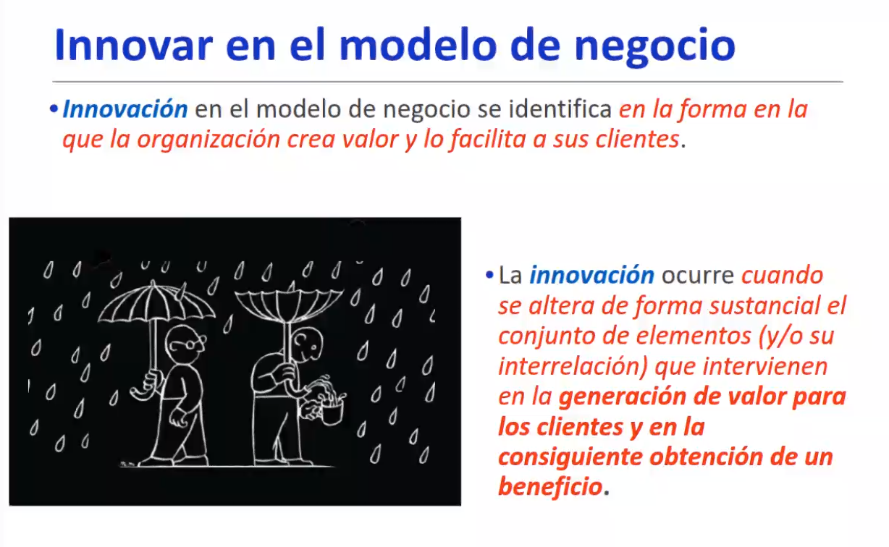

## Inovar en el modelo de negocio
Convertir el conociemtno en realñides industriales

`Innovacion = invencion + comercializacion`

1. Abakuzar las oportunidades
2. Salir a observar
3. Simplificar y enfocar
4. EMpezar por pequeño
5. Buscar liderazgo