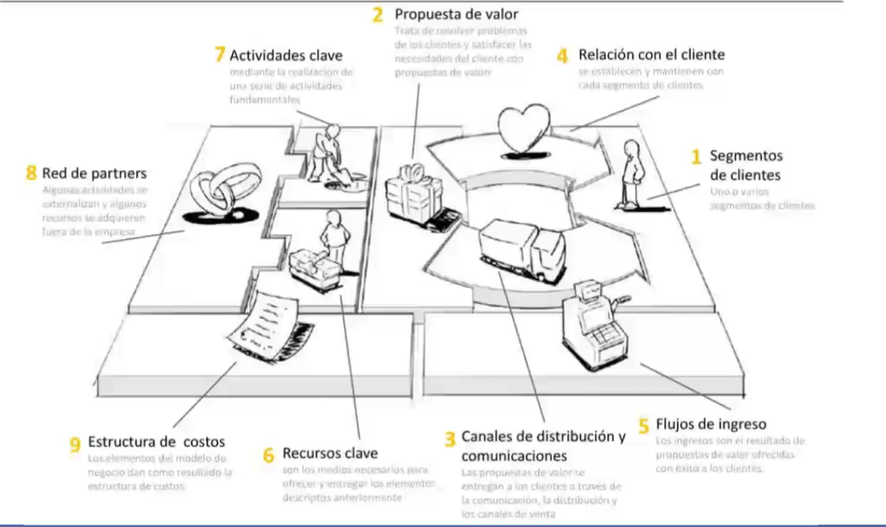
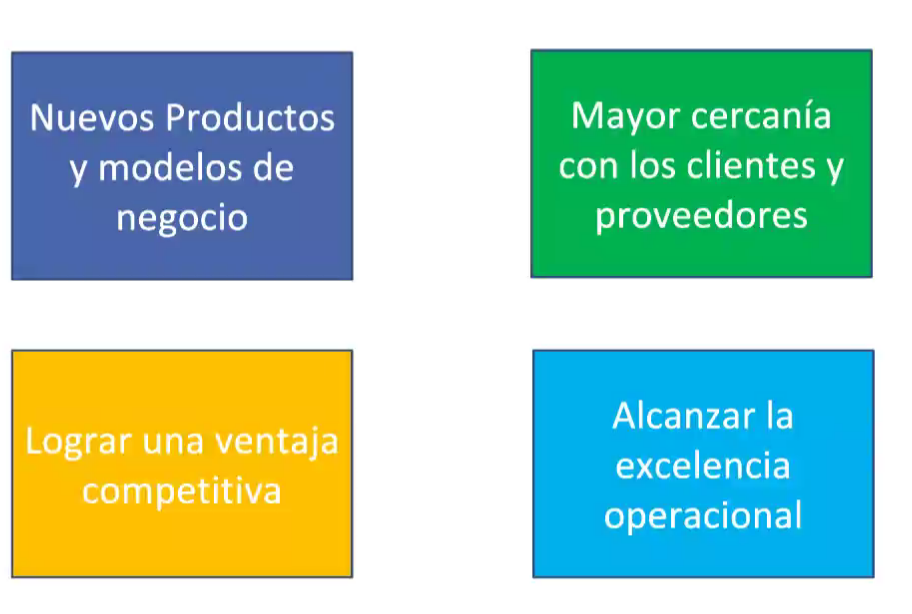
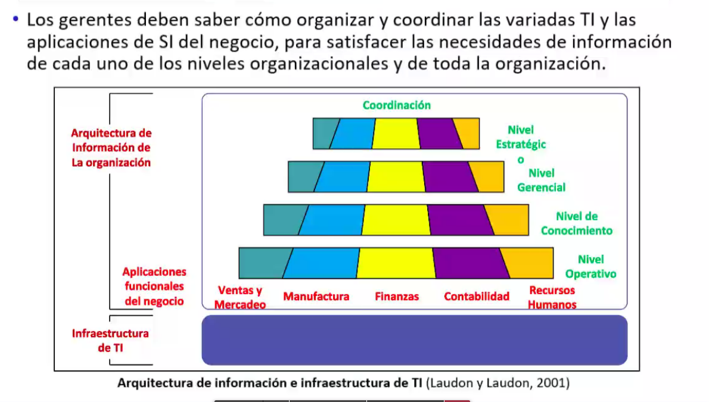
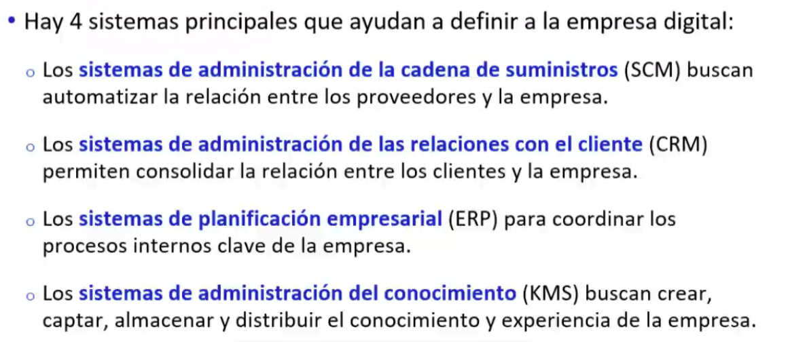
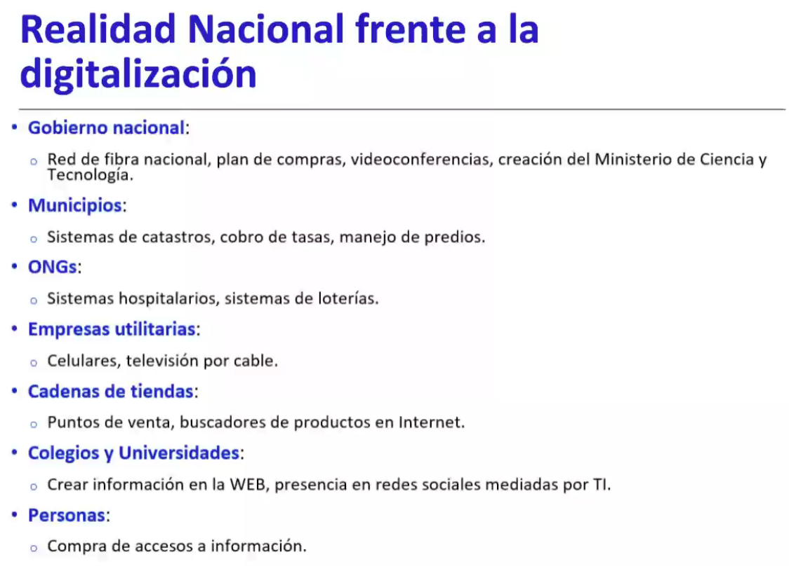
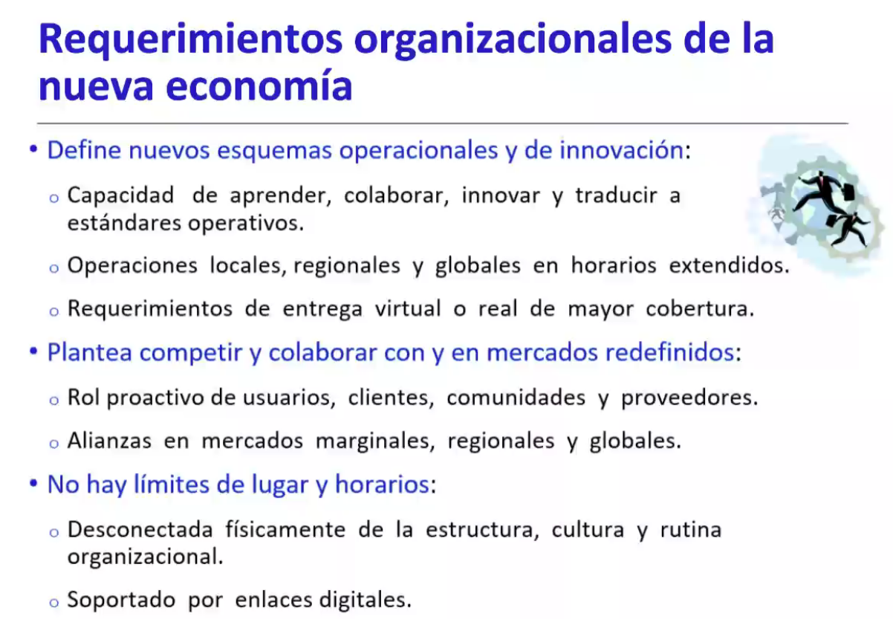
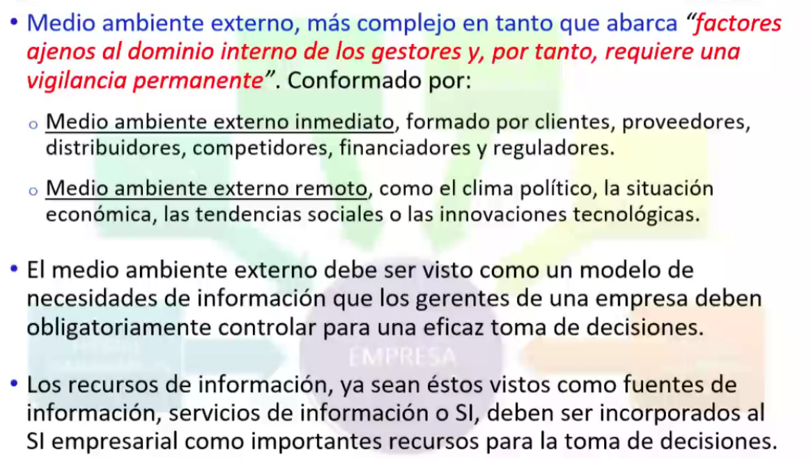

# Analsisi de las organizaciones con cadena de valor

## Relacion entorno

La relacion es en 2 vias:
- el entorno influye en las organizaciones
- las organizaciones puede influir en el entorno (INNOVACION)

## Estrategia y Entorno
La esencia de la formulacion de la estrategia competitiva consiste en relacionar la organizacion con el entorno.

- aumenta la eficiencia d elos procesos
- habilita completamente nuevos procesos que son capaces de transformar las empresas
  - cambio del flujo de infomracion
  - reemplazo de activdades secuaencuales por paralelas
  - elimina atrasos en la toma de decisiones

### Las 5 fuerzas competitvas

- clientes: 
- proveedores:
- competidores:
- productos sustitutos:
- rivalidad de la industria:

### Modelo de negocio
- Segun Osterwaler: una herramient conceptrual que decribe la logica como una org crea y entrega vlaor
- magretta explicar conceptualmente como funciona su negocio

Canvas explica con compoente como interactual para describir el modleo de negocio

- produccion
- gest funanciera
- marketing
- logistica y distribuicion
- diseño

Soportan todos los procesos dentro del ciclo del negocio

# EL rol de la TI y el manjejo d ela informaicon con los SI

Las TI solo son vnetajas cuando no son implementadas por todas las demas empresas, si todas las tienen solo son commodities

Las TI son solo un medio:
- permiten capturar datos convertir en informaicon
- transformar la informacion en ventaja, para sacar insights
- facilitan la intelgencia artifical

No solo da plataformar si no que permiten tener una vision globaL y privilegiada para la socializacion d elos procesos de negocio y la habilidad para identifdicar que es clave para alcanzar el objetivo de la compañia conectada.

Los roles son:
- automozatizacion
- informacional: acceder a la info acociada a los procesos para que la podamos analziar
- secuanciacion: pueden cambiar la secuncia de los procesos llevandola de serial a secuencia en paralelo lo cual disminuye el tiempo del ciclo produccion
- monitore: seguimiento del desempeño de los procesos
- analisis: depirarla limpiar organizarla identificar patrones
- geografico: distribuir sus proceoss geograficamente
- integrador: moverse hacia el enfoque de encargado del caso, diferentes lenguajes se variso sistemas entre si
- intelectual: digamos que es otro tipo de integracion, pero a nivel mucho mas alto o estrategico, el Know-How de la empresa
- desintermediacion: esta claro que la intermediacion humanda en las emrpesas son fuentes de error y retrasos

Sebrooming, ir a la web y luego a latienda
Showrroimg ir a al tienda y luego comprar

Personalizacion masiva:  Captura las prefereniaas iniciales del cliente para hacerla vivir una expresian personal en linea

Org dinamica o agil
Se requiere tecnologia para:
- admitrar las relaciones con los contactos
- apoyar el trabajo de grupos que trabajn en difenete localidades
- administrar dle conocimeinto adquirido

# Como la adminsitracion de la info ha cmabiado la forma de hacer negocios 

## Transformacion de las economias inditruales
- Economias basadas en el conocimeito e informacion 
- producto y servicios nuevos
- Conocimiento: un activo central productivo y estrategico
- competenia basada en el tiempo
- vida mas corta del producto
- entorno turbulento
- base limitada de conocimiento de lso emp
- trabajo colaborativo

Plantea que la contruccion de la riqueza y bienestrar esta soportada principalmente por el conocimiento y el uso importante de las TI, no solo para la comunicacion interpersonal sino, ademas, para la creacion nuevo saberes

## Tranformacion empresarial
- organizacion plana, empoderada o hiperjerarquica:
  - decentralizacion
  - flexible
  - trabajo cooperativo
  - independeinte de la ubicacion
- Bajos costos transaccionales
  - automatizacion de procsos
  - reciclaje del conocimiento

## Empresa digital
- relacion con clientes mediaos digitales chatbot
- procesos fiunadmentales de neogcios ejecutados a traves de redes dig
- admintracion digital de activos coportativos calve
- percepcion y respuesta rapidas a los cambiso del entrono
- trbajao colaborativo

### Que es una empresa digital
Aquella en la que casi todas las relacione ssig de negocios d ela org con los cleintes, proveedores y empleados se realizan y controlan digitalmente, sus procesos de negocios sean digitales, sean automatizados.

- herramientas de trbaajo en grupo para comaprtir datos
- herramientas de interaccion con grupos de interes

Los procesos se compe,tan a traves de redes digitales: lan, wan, movil

Las empresas digitales se distiguen de la stradiciaones por si casi total dependecian de un conjutno de TI en los aspectos de adminsitracion y organizacion

Una nueva economia:
- basada en mayor disponibildiad
- su productividad interpretacion de sus datos en ifmromacion y su trnafo en conocimeinto

## Reuqerimientos organizacionales de la nueva economia

# Problemas en la adminitracion de la informacion

- Factores como el personal, la estrucutra, sus politicas y recompesas que ejercen influencia en la manera de realiza el trabajo y de conseguir los objetivos
- todo factor que impide el intercambio de info enrtre emisor y receptro es una abarrera para la com
- los genrtes son enecargados de identificar comprende y solucionar los problema1s y las barreras de comunicacion e intercambio de informacion, por loq ue apsan la mayor parte de su tiempo comunicacionse

Flujo de informacion detro de una organizacion viene dado por lo siguiente:
- com ascendente
- com desc
- com horizontal
- com digonal

Problemas de la gestion de informacion:
- fragmetacion de los datos, mantener todas esta base sd edatos
- integracion de software, demasiada intregracion, 
- automozatizacion incompleta: 
  
complejidad increible, costo mucho, poco fiables, inseguros

se ifnorman de cuando dodne quieren, las emrpess lideres de ayer no mañana, exignete en temrinos d e inovacion, cmabiado al cultura de informacion
todos su procesos y operaciones digitales, progresar o desaparecer

# Arquitectura empresarial