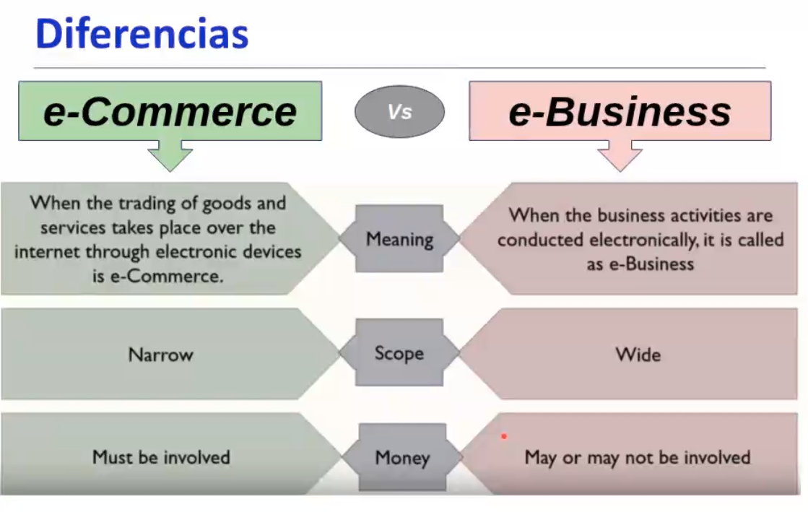
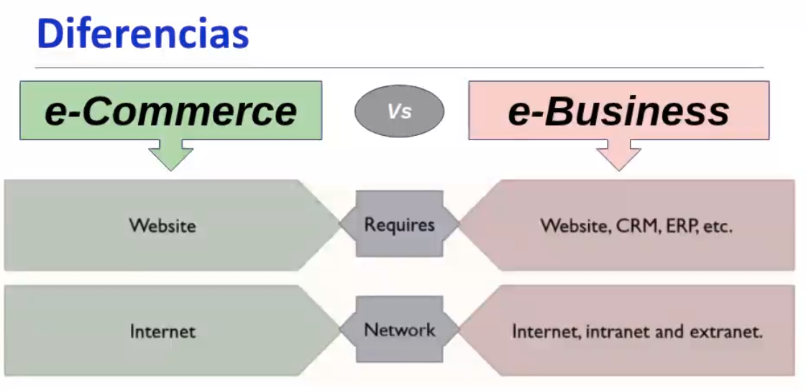
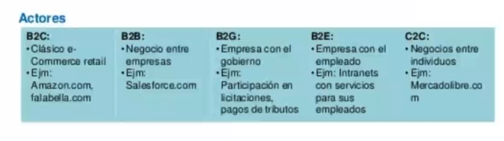
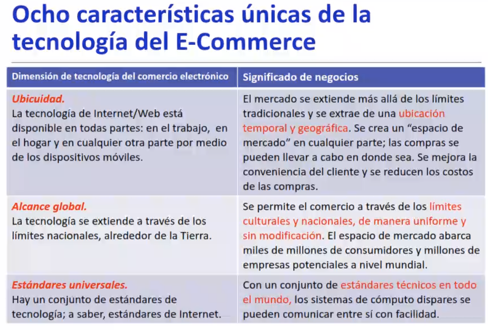
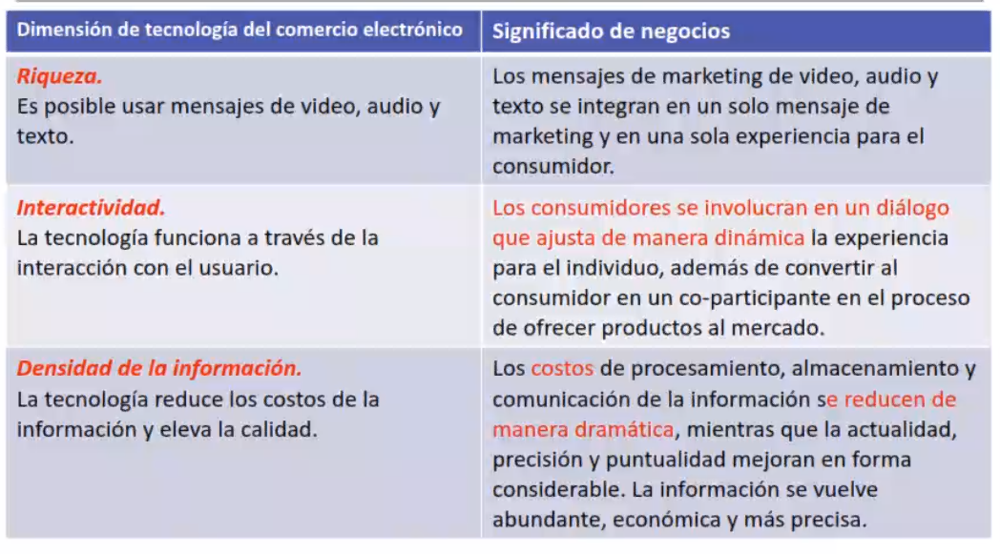
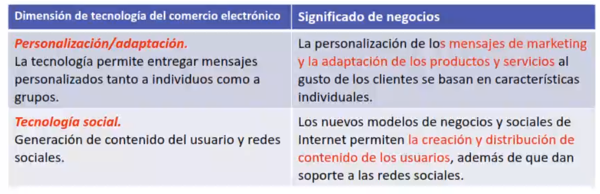
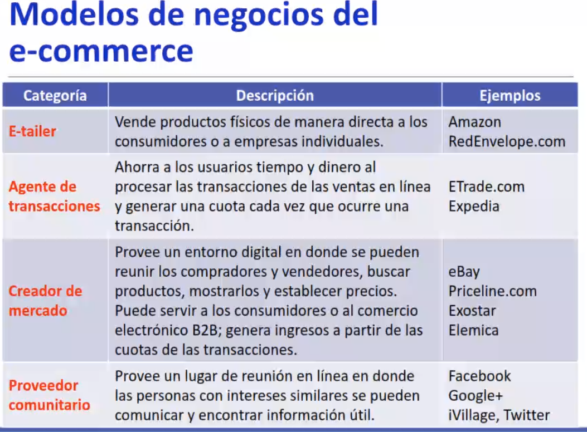
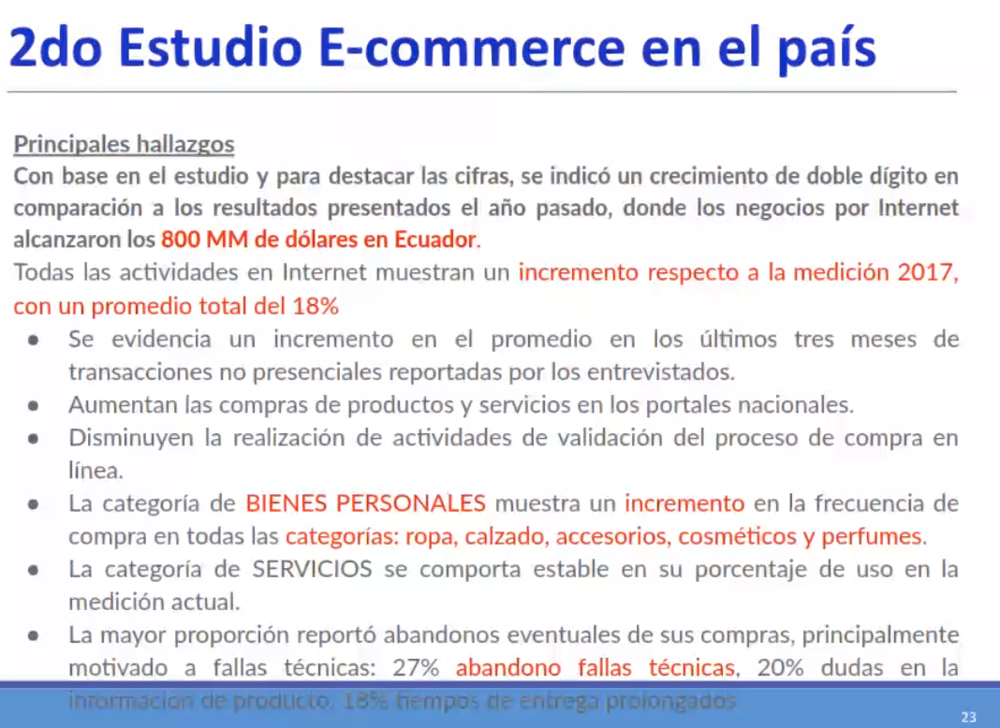

## Comercio electronico, E-Comerce

Accion de compra y venta de manera digital, online

### Internet en los negocios

Impactos positivos:
- variso canales, web, smartp, VoIP, redes socialkes
- redducion de costos
- mejorar la productividad, comunicacion, info compartida, google docs, dropbox, etc
- aument ala accesbilidad almacenamientoi
- faclita la invetaigacion, conocer el mercado, encuentas a cleintes, bases de datos
- facilidad para empezar nuevos negocios, comenzar con un buen sitio web

Impacto negativos:
- compentacia feroz
- menor contacto persona, correo elettronico, mails masivos a los clientes, FAQ, maquinas que responden (bots)
- seguridad, robo de identidad, fraudes
- reputacion, comentarios sobre la empresa

E-BUSINESS: Uso de tecnologia digital e internet par aejctuar pinircpales procesos de nogocios en la empresa

## E-commerce vs E-business

Los gobiernos deberian ser electronicos, todos sus procesos y procesos al serrvicio d ela ciudaddia deberian migrar a la nube.

Otros modelos:
- e-procurement: aprovisinomiento a traves de medios digitales.
- e-financials: servicios financieros a traves de medios digitales.
- e-learning: servicios educativos a traves de medios digitales.
- e-banking: serivicos bancarios a traves de medios digitales.
- e-goverment: servicios bancarios a traves de medios digitales.
- e-marketing: serivicos de marketing a traves de medios digitales.

## Caracterisiticas unicas de la tecnoliogia del E-Commerce

Las cat mas basicas:
- businnes to customer
- busi to bussi
- consutomer to costumer

- gov to bu
- gov to cos
- gov to gov

## Estudio

