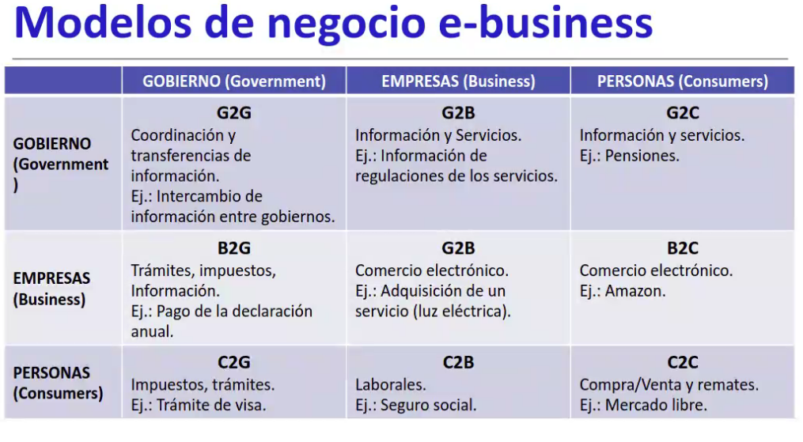

## Comercio electronico

Accion de compra y venta de manera digital, online

### Internet en los negocios

Impactos positivos:
- variso canales, web, smartp, VoIP, redes socialkes
- redducion de costos
- mejorar la productividad, comunicacion, info compartida, google docs, dropbox, etc
- aument ala accesbilidad almacenamientoi
- faclita la invetaigacion, conocer el mercado, encuentas a cleintes, bases de datos
- facilidad para empezar nuevos negocios, comenzar con un buen sitio web

Impacto negativos:
- compentacia feroz
- menor contacto persona, correo elettronico, mails masivos a los clientes, FAQ, maquinas que responden (bots)
- seguridad, robo de identidad, fraudes
- reputacion, comentarios sobre la empresa

E-BUSINESS: Uso de tecnologia digital e internet par aejctuar pinircpales procesos de nogocios en la empresa

