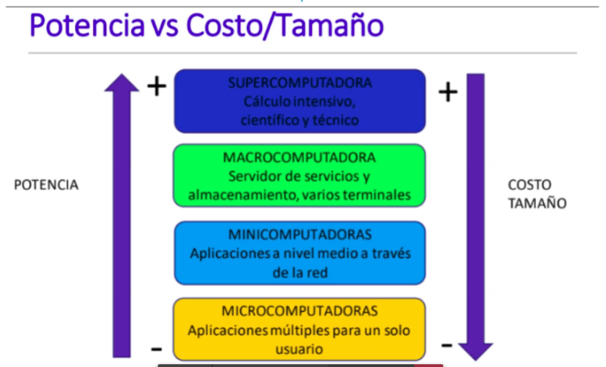

# Tecnologias de la informacion
- software
- hardware
- comunicacion (how work)
- data

## Comunicacion de los datos
- emisor: inica las comunicaciones
- transductor: dispositvo que cambia una forma de enrgia a otra
- canal o medio: mecanismo usado para trnasportar la comunicacion
- receptor: recibe la info
- contenido: es la información transferida

## Formas de conexion
- punto a punto
- punto a multipunto: conectar a las computadoras
  
## Tipos de redes
Se expaen grandes distancias, modem acronimo para modulacion y demodualacion:
- Red de area local, red de computadoras de distancia limitada (LAN)
- RED DE AREA AMPLIA: conextar varias redes con otras redes

## Medios de transmision
Usan antenas o espectro electromagnetico para conexiones entre dos o mas puntos. punto a punto popunto multipunto
Alambricos:
- cable de cobre
- cabre tenzadro
- coaxial
- fibra

Inalambrica:
- wifi
- inflarrojo
- microondas
- satelites
- gsm, grps, 3G, 4G o 5G

Las agencias gubernamentales y los acuerdos internacionales son los que asigna frecniuencas especificas a cada tipo de servicio

### Satelites
conjunto de rececptr/trnamisor lanzado por un cohete y colcoado en orbita alrededor de la tierra
- noralmente tinee 32 transpondders con capacidad de 100 mbits por un segundo
- la cobertura de la tierra aumenta con la altura
- desviacion: atraccion lunar, choques, se corrigue meidnate pulsaciones

trilateracion mas de un stelite apra ubicar. 24 gps estan en usopara ubicar
### VPN
seguridad, tunel

### Velocidad de trnasmision
Media que describe cuanta informacion puede enviarse por un enclace en un moento dado. Velocidad del caudal

### Ancho de banda
Es el rango de frecuencia de un enlace (canal) meiddo como la diferencia entre la mas alta y la mas baja frecuencia. Es el ancho dle tubo

## Reglas de comuiunicacion
### Protolocos
Reglas detallaas, secuncias, formatos de mensajes y procedimientos que usan computadoras para intercamiar mensajes

### Protoclos
TCP/IP:
- ip: identificacion de origen y destino
- tcp: Transporte de paquetes de informacion 
...

Otras capas

## Hardware y la infraestrucura TI
Hardware:
- constituye la base fisica la nfrastructra de TI
- su entendimiento basico es util para tomar deciciones que beneficien el desempeño de la organizacion
  
## Supercomputador
- Tiene billones d eintrucciones flotantes por segundos.
- Calculos por segundos complejas

## Mainframe
- Copmputadoras para corporaciones
- Multiples procesadores paraellso 128 megabytes
- Bus de fibra optica para conectar dispositovs externos

## Minicomputador
- usado como procesador central en empresas emdianas o procesador departamental en grandes empresas

## Servidor
- Pequeña y mediana empresa
- uno o varios procesadores
- diseñados especificamente para compartir recursos en entorno de redes

## Workstation
- computadra de escritorio
- configurada usualemtne a funciones especiales, ingenira, diseño grafica, diseño de modas

## Microcomputador o PC
Escritorio o portal diseñado para un usuario

## Estaciones de red
Computador simplificado que no almacena programas o datos (supermercados registro de compra)

## Micro computador
Computador de mano

## Servidores Blade
- Computadoras ultradelgadas que consisten en un tablero de circuitods con proceadores, memoria y conexiones de red que se almacena en estantes
- Ocupan menos espacio que los servidores tradicionales en gabinete

MNetcalfe desarolló la redes de compu con cables coaxiales, luego con cable cobre. El hablaba sobre el valor de la red: Este valor potenical va aincremntando de manera exponencial, mientras mas miembros en la red, mas valor tiene la red

## Computacion GRID
Se refiere conetar muchas computadoras y tenerlas como un solo computador

Orgnizacion de las computadoras

Relacion del costo y potencia de las computadoras

### Ley de Moore

Se duplica el num de trnasitores o reduce el precio.

## Ley del alamacenamiento masivo

Ley de almacenamiento digital masico e sun seungo impulsor de la tecnologia de la intraestrucutra de TI.

## SO
se encarga de administrar los recuross del computador. incluye controladores de dispositovos, servidores, sistemas de ventanas y programas de utilidades. Permite coordiar todos los dispositovos externos de la computaodra como impresora, mouse, teclado, monitor, etc.

- sistema de entrada salida baisco: BIOS
- firmware: controla el func y el rendimieto de lso quipos
- sistema operativo: interactua con el hardware y disp internos
- software de utilidad: regula la funcionalidad del equipo meidante el analsis de su rendimiento, configuracion y optmizacion de procesos

## Aqr de sistema
es la estrutura o estruutas del sistema, comrende componetes, propiedades externas de esos componetes y la interaccion entre ellas

- Elmentos computaciones: entidad tales como clientes, servidores, bases de datos, filtros, capas de iuin sistema jerarquico
- interraciones: ocurren entre los elementos a nivel de diseño

Componentes:
1. Aqr de informacion: los datos, como se esquematizan, a traves de una db, como se relacion de un dep a otro. que logica tienen
2. aqr de negocio: procesos de negocios, generalmente aqui se describe terminos capacidades y tecnologia de soporte, reles actores y evnetos que prseta la orgniaacion, encamindaos a la mision y vision. procesos generadores de valor
3. aqr aplicacionales: se describen todos los sistemas de informacion, usados en el negocio, se ayuda a la automatizacion de procesos
4. arq tecnologica: las redes que se manejan, servicios de red, cual es la configuracion, como maneja el centro de almacenamiento. cual es el metodo de ocntrato con internet

Atrbutos de calidad de un sistema
- ejeccion: desemppese, seg, disponifi, funcionabilidad, usabibildad
- modificable, portabilidad, reusabilidad, integrabilidad, evaluabilidad
- negocio: time-to-market, costo, tiempo de vida pryectado, mercado atacado, planificacion, uso extensivo de los legacy systems
- aquitectura: integridad conceptural, correctitud, completitud. facil de construir.

