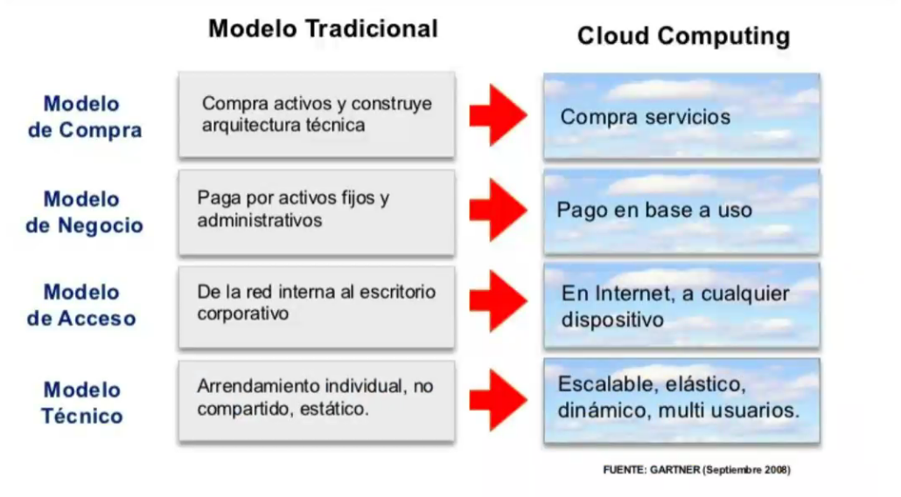
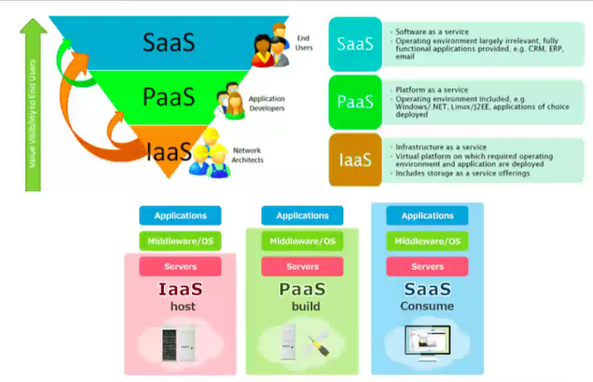
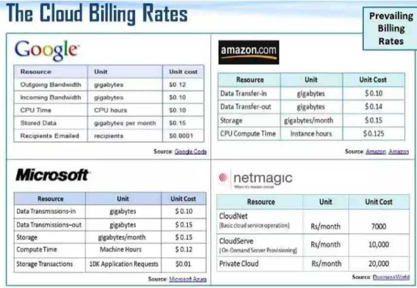

## Multiples perpectivas
Para relacioanr los datos se usa una base de datos relacional (estructurados), ya sea proveedores, poroveedores de valor etc.
Se conocen el CRUD a realizar en los registros de la base de datos.

## Diferentes datos

- Datos operacionales: los dots de ventas, de inventario, salidas de produccion. Internos de la empresa
- analisis de sentimientos, externa a la empresa. No cumple una estructura

## No relacionales
Aparece con la llegada de web 2.0, cualquier usuario podia subir contenido proveocando asi un crecimiento exponencial de los datos

- cuando el volumen de lo datos crece muy rapidamente
- la escabilidad de la solucion relacion no es viable como costo y tecnico
- elevados tipocs de uso del sistema
- cuando el esquema de la DB no es omogeneo, cada insercion de datos la informacion que se almacena puede tener campos distintoss

## Ecosistema
Costo de propiedad:
- mantenimiento
- redes
- sistema oeprativos

Tercerizan el el proceso de atencion. Procesos de consultoria de modificacion en los sitemas. Tercerisan el soporte de usuario. La adminitracion de las bases de datos, software , licensia, backups, la capacitacion

## SLA - Acuerdos de nivel de servicio
Son acuerdos donde se definen cuales son las responsabilidades y los niveles que debe ofrecer la institucion proveedora al cliente, y poder tomar en consideracion que esos acuerdos se cumplan dentro de los plazos estalbecidos. Pued tomarse en considreacion penalidades.
Ejemplo:
- si exite un problema de internet, tiene que resolverlo en no mas de 5 o 10 minutos.

## Adquisiones

- planif hardware
- relacion el precio del rendimeinto hardware
- vent o desvent de cnetralizar, distribuir usar tenologia de punta.

Adema   s de los criterios anteriores, considere el costo total de propiedad de tecnologia para evaluar las adquisiciones

## Administracion de activos

### IMpacto de la era digital
- proliferacion de quipos de computacion en la organziacion
- movilidad de los quipos y componetes
- corto ciclo de vida de lso quipos
- demanda ed ayuda para la resolucion de problemas

### Nuevas responsabilidades genrenciales
- estandarizacion de equipos y actualizacion de estandres
- inventario actualizado de activos
...

## Total Cost ownership (TCO)
metdos para evular todos los costos de adquisicion de tecnologia

- admiquisicion de hardware: equipo de computadoas terminales
- adquisicion software: licensias
- instlacion: instalaar
- capacitacion
- soporte
- mantenimiento
- infraestrucutra
- tiempo inacitvo: costo de perdido de produccividad si las fallas de h y s provoca que el sistema no este arriba
- espacio y energia

## Centralizada vs Distribuida
modelo fisico que concentra o distribuiye los equipos considerando la distribuicion fisica de la empresa y sus operaciones

Centralizado:
- unico estandar
- mayor control
- daño en el equipo detiene todo
- tiempo de repsuesta no e el mejor

Distrivuido:
- mayor flexibilidad
- oportunidad de un mejor tiempo de respeusta
- requiere personal especializado

## COmputacion en la nube

- autoservicio bajo demanda
- acceso ubicuo a la red
- agrupacmiento de recuross independiente de la ubuicacion
- elasticidad rapida
- servicio medido

## Modelos de computo

## Tipos de servicios

Infraestrucura como servicio (IasS)
los cleintes utilizan el prpcesamiento, el almacenamient, la conexion en red y otros recuros de computo d elso proveedores de serivico en la nuibe para oeprar sus sistemas de informacion.

(Plataofroma) PaaS
Usan infraestrucura y herramientas de programacion hostpedades por el proveeodr de servicios para desarrollar sus propiedas aplicaciones (databases, librerias aplicacion framework, lenguajes d eprog)

Software en la nube (SaaS)
usa el software que el distribuido aloja en su hardware y ofrece a trves de internet. Aparte dle almacenamiento, servidores, lenguajes de programacion aparte de todo eso permite

## Ahorroa a largo plazo

mucho es mejor beneficio un servicio a tneer un servidor fisico y darle todos los mantenimientos y demas requsisitos para su funcionamiento.

## Internet de las cosas (IoT)