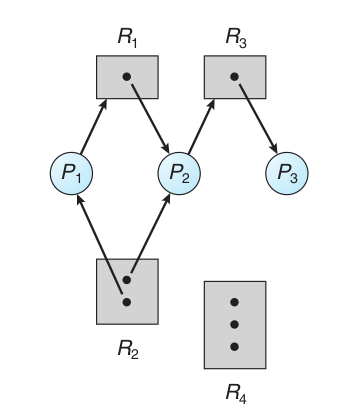

## Deadlock

Normalmente los proceso pueden competir por un numero finito de recursos. Un proceo que requere recursos entra en una estado de espera si estos no llegan a estar listos. A veces  un proceso que esepera nunca cambia si estado, porque los recursos estan siendo pedidos pro otros recursos que a su vez tambien estan en espera. Lo que ocasiona una espera circular, **DEADLOCK**

### System model

Un sistema consiste en un numero finito de recursos, que se distribuyen entre un numero de procesos que compiten por ellos. Los recursos son particionados en algunos tipos, cada uno consisten en algunos con instnaicas identicas. Espacio de memoria, ciclos del cpu, archivos, y dispositivos de E/S, son ejemplos de tipos de recursos. 

Si un proceso requere una instancia de un tipo de recurso, la asignacion de alguna instnaica de ese tipo derecurso satisfacera la peticion.

Un proceso solo pueede usar un recurso en esta secuencia:
1. Request, peticion: el proceso solicita el recurso, si la solicitud no se reakzia inmediatamente, entocnes el proceso debe esperar hasta que se pueda asinarle el recurso
2. Use, uso: el proceso puede operar el recurso
3. Release, liberacion: el proceso libera el recurso que ya no esta usando

**La peticion (request) y la liberacion (release) de recursos son llamadas al sistema**, como explicamos en el cap 2. Ejemplo de request() and release() dspositivos, open() y close() file, and allocate() y free() son llamadas al sistema.
Algunas peticiones y liberaciones no son administradas por el SO, como cuando se usa wait() y signal(), en estos casos estos recursos que se usan no son adminsitrados por el SO, si no por el usuario que se encargo de escribir el codigo para su adminsitracion.

## Deadlock characterizacion
- exclusion mutua: solo un proceso a la vez puede usar el recurso
- hold and wait: Un proceso debe estar reteniendo por lo menos un recurso y en espera de adquirir recursos adicionales que actualmente están siendo retenidos por otros procesos. 
- no preemption: Los recursos no pueden ser prevenidos; es decir, un recurso sólo puede ser liberado voluntariamente por el proceso que lo tiene en su poder, después de que ese proceso haya completado su tarea.
- circular wait

Los circulos son los procesos y los Cuadrados **el tipo de recurso**, finalmente los puntos negros las **instancias** de los ttipos de recursos. Si un proceso hace una peticion por un recurso se dibujo una flecha que va **desde el proceso** hasta el **rectangulo, que es el tipo de recurso**. Si un proceso ya tiene asignado una instancia de un tipo de recurso, entonces se dibuja una flecha que va desde el **punto negro que es la isntnacia dle recurso** hasta el ciculo del proceso

Para que haya un dealock, una condicion **necesaria pero no suficiente** la existencia de algun cilo en el grafo, cada grafo es una snapshot del estado actual de los recursos y asinacion de los mismos hacia los procesos.

## Metodos para manejar deadlocks

- podemos usar un protocolo para evitar deadlocks, asegurandolos que nunca estaremos en uno
- podemos permtir entrar en deadlock, detectar y salir de el
- podemos ignorar el problema y pretender que el deadlock nunca ocurrio en el sistema

La tercera solución es la utilizada por la mayoría de los sistemas operativos, incluyendo UNIX y Windows; luego depende del desarrollador de aplicaciones escribir programas que manejen los bloqueos.

## Evitar deadlock

Antes de dar un recursos a un proceso, se asegura que no haya un deadlock

Basic Facts

- if a system esta en estaod seguro => no deadlock
- if el sistema no esta =>  pueda que haya deadlock

Hay que buscar una secuencia de procesos para que no se formen nunca ciclos, para evitar entrar en el modo INSEGURO

Vector Avaible, cada entrada es un tipo de recurso y el valor es la cantidad disponible

Max: Proceos i requeire k instnacias como maximo del recurso j

Allocation: proceso i tiene k isntnaicas asignadas del recurso del tipo j

Need: proceso j probablemente neceista k instnacias del tipo de recurso j

