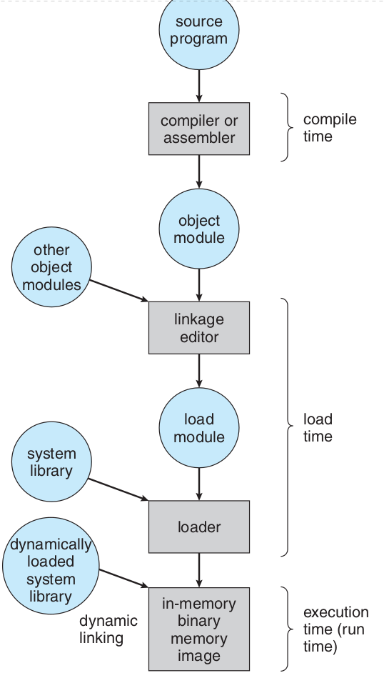
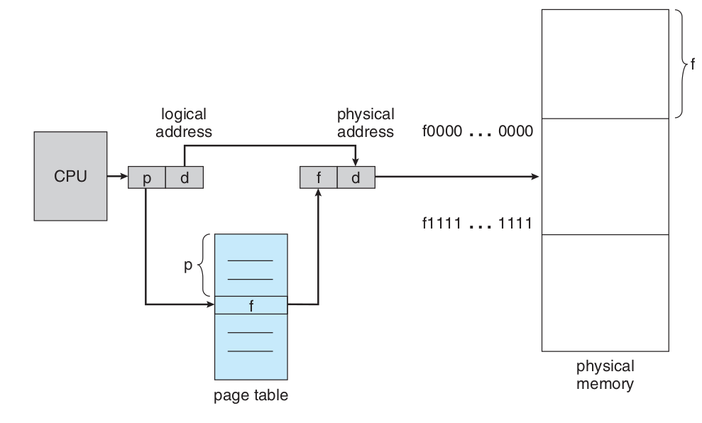
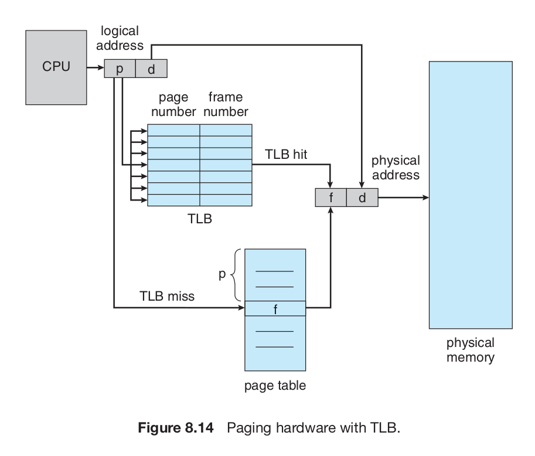
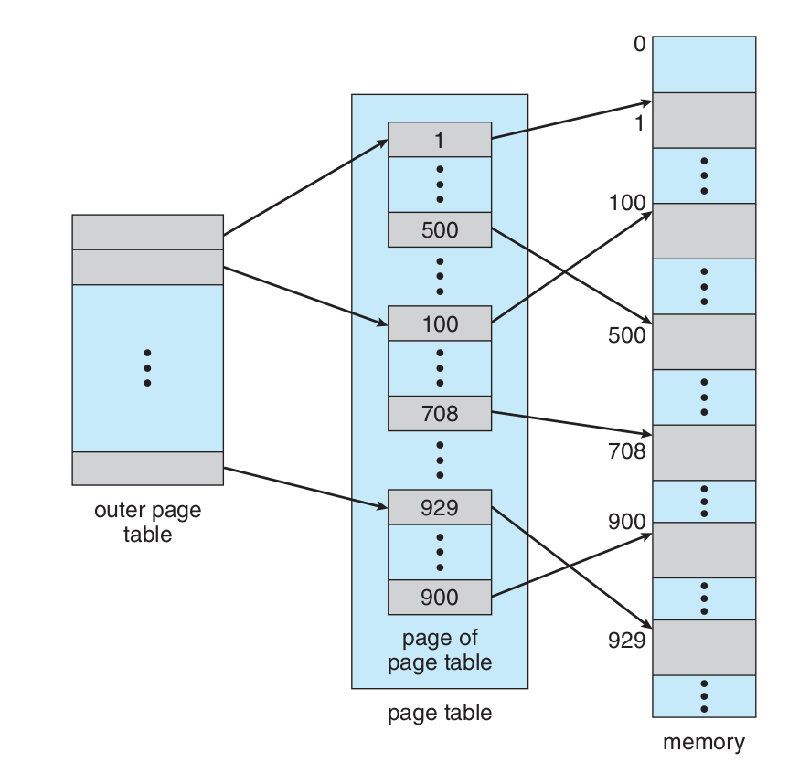
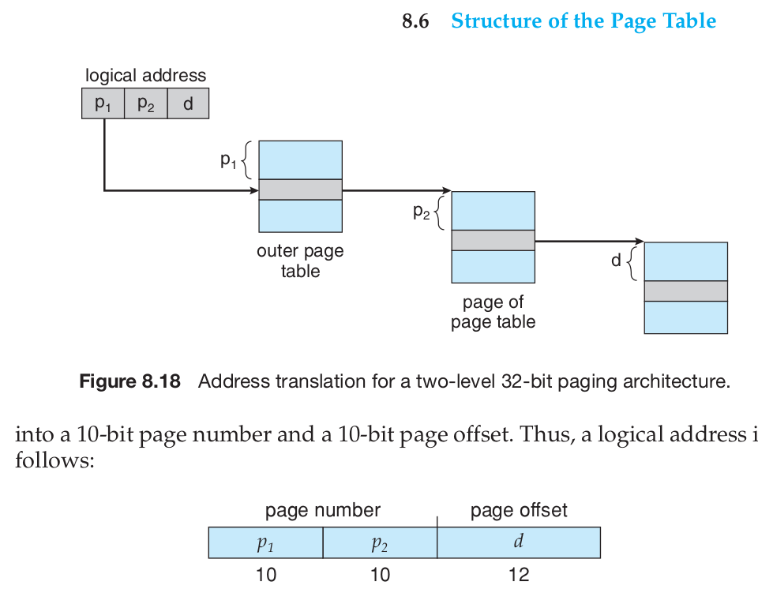
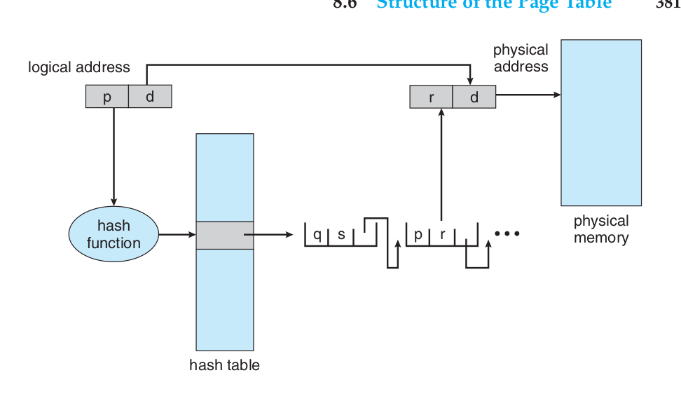
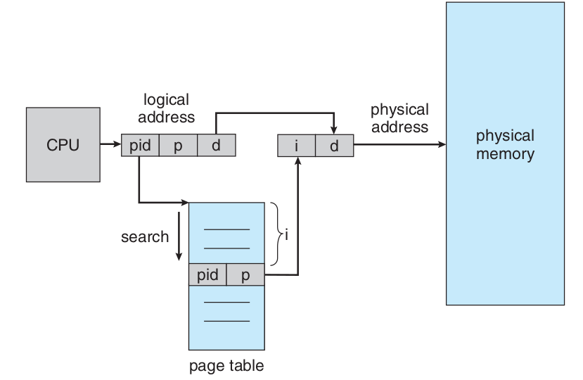

# Memory

## Background
La memoria consiste en un array de bytes, cada uno con su propia direccion. El CPU fetch instrucciones probablemente causa una carga almacenamiento a una direccion de memoeria especifica.

Una tipica isntruccion es por ejemplo el primer fetch una intruccion desde memoria. La intruccion es entonces decodificada y causa peticiones desde la memoria. Despues la intruccion ha sido ejecutada el resultado probablemtne es guardado en memoria.
La unidad de memoriua no sabe como son generados los datos.

### Basic Hardware

La memoria principal y los registros son construidos por solo un proposito en genral que es almacenar datso apra que el CPU acceda directamente. Hay intrucciones de maquina que toman dirr de memoria como argumentos, pero no direccioens de disco, Por lo tanto, cualquier instrucción en ejecución, y cualquier dato que esté siendo utilizado por las instrucciones, debe estar en uno de estos dispositivos de almacenamiento de acceso directo. Si los datos no están en la memoria, deben ser movidos allí antes de que la CPU pueda operar en ellos.

Los registros del cpu pueden ser accedidos desde un ciclo del cpu,. algunso cpus puede decodificar intrucciones y ejecutar una simple operacion en un registro al mismo tiempo por tick. Esto no aplica para la memoria, la cual es accedida atravez dea transacion en el bus de la memoria. Completar un acceso a memoria puede demorar algunso ciclos del cpu. En esos casos el cpu se stall desde que no tiene los datos. El remodio es añadir meoria rapida entre el cpu y la memoria principal, tipicamente en el chip del cpu.

Se debe protejer el sistema operativo, de accesos indevido por procesos de usuario. En sistemas multiusuarios, debemos adicionalmente protejer entre procesos de usuarios. Esta procection de hace dssde el hadware por que el SO **no interviene usualmente entre el CPU y los acceso a la memoria** (por causa de perdida de rendimiento) 

Primero tenemos que aseguranos que cada proceso esta en un especio de memoria diferente, para seprarlos necesitamos la capacidad de determinaar el rango del legal adresses que cada proceso puede acceder y asegurarnos el proceso puede accedeer a solo ese espacio. Podemos proveer esta proteccion usando dos registros usando un **base** y un **limit**, La base del registro mantiene la direccion legal mas pequeña y el limite especifica el tamaño del rango (la direccion dle final).

La proteccion de especio de memoria es cumplido teniendo el hardware del cpu que compara por cada direccion generada en modo usuario con los registros, Cualquier intnetno por un programa de ejecucion en modo usuario para aceder a la meomria del sistema operativo o memoria de OTRO usuario resulta en TRAP al sistema operativo, cual trata ese intento como fatal error. La base y limite puede ser cargado solo por el Sistema operrativo, cual usa intruccion priviligeadas, desde las intruccions priviligeadas puede ser ejecutada solo en modo kernel, solo el sistema operativo puede cargar la base y el limite.

### Adress Binding

Normalmente los programas reciden en el disco, como un ejecutalbe binario, para ejecutarlo el programa debe cargarse en el memoria y puesto entre los procesos, dependiendo de admisitrador de memoria en uso, el proceso puede ser movido entre el disco y la memoria durante esta ejecucion.

Clasicamente el binding de las intrucciones y memoria puede ser dada por dos pasos
 
- Compilacion: Si sabes en el momento de la compilación dónde residirá el proceso
en la memoria, entonces se puede generar un código absoluto. Por ejemplo, si se sabe que un proceso de usuario residirá a partir de la ubicación R, entonces el código de compilador generado comenzará en esa ubicación y se extenderá hacia arriba desde allí. Si, en algún momento posterior, la ubicación de inicio cambia, entonces será necesario recompilar este código. Los programas en formato MS-DOS .COM están vinculados en tiempo de compilación.

- Carga: si no se sabe en tiempo de compilacion donde resideria el prcoeso en memoria, entonces el compilador debe genrear relocatable code, entonces el binding es delegado hasta el tiempo de carga, nosotros necesitamos solo recargar el codigo de usuario para incorporar este cambio.

- Ejecucion, si el proceo pued eser movido durante su execucion desde un lugar de memoria a otro, entonces el binding debe ser delegado hasta que el programa corra, hay hardware especial para este esquema, la mayoria de los sistema operativos multiproposito usan este metodo.

### Logical vs Fisica adress

una direccion genrada por el cpu es comunmente referedira como una direccion logica, mientras que cualquier direccion de la unidad de memoria es comunmente referida como direccion fisica.

Los metodos de binding adress de comoilacion y carga geenran identicaslogical y fisica adress, sim embargo la ejecucion genera logica y fisica diferentes, en este caso, usualmente referimos la local como virtual. EL seet de todas las direciones logicas generados por un programa es el especio de direcciones logicas. 

EL mapeo de direcciones logica a fisicas es dada por hardware, llamado Memory managment unit, podemos escoger desde cuales meotods para cumplir tales mapeos. El registor base es llamdado relocation register, el valor in el relocation register es añadido para cada direccion generada por un proceos de usuario en tiempo que es enviado a memoria. por ejemplo si la base es 14000, en un acceso a la locacion 346 es mapeado a 14346.

EL programa de usuario nunca mira la direccion real fisica. el programa puede crear un puntero para localizar 346, almacenarlo en memoria y manipularlo, comparlo con otros direcciones de memoria. logica va de 0 al max y la fisica va de R + 0 a R + max.

### Carga dinamica

Para tener menjor ustlizacion de la meormia, podemos usar la carga dinamica, una rutina no es cargada hasta que no es llamada, todas las routinas son mantenidas en el disco y un formato relocatable, el programa principal es cargado en memoria y es ejecutado, cuando una routine es llamda por tora, la llamda primero chequea si esta nueva routien esta cargada,m si no esta entonces relocatable linking loader es llmadado para carfar la routine deseada en memoria, entonces el control es pasado nuevamente a al routine. (Esto para routines el usuario no para el SO)

La ventaja de esto es que las routine es carda solo cuando se la necesita, este meotod es paroituclamente util cuando la cnatidad de codigo es grande. este metodo no requiere de soporte especial desde el SO, es resonsabildiad del usuario diseñar sus programas para tomar la ventaja de tal metodo el SO puee ayudar al programador proveendo librerias para implentar la carga dinamica.

### Dynamic linking and hared libraies

DLL son sistemas de libreias que son linkeadas al prgorama de usuario cuando el prgora aesta corriendo, algiunso SO soportar solo linkeo statico, en tales sistemas  librerias son tratadas como otro modeulo de objeto que es cominado por el loader en la imagen dle prgoram  a binario, Dynamic linkinf en contrate es similar que carga dinamica, aqui el linknig en logar de cargar es pospuesto hasta el tiempo de ejecucion, este caracterixi< es usuario en literias del sistema, tales como subroutines. sin este facilidad cada programa del sistema devera incluir una copia del lenguajes de la libreria, en la iamgen dle ejcutable, este requerimenti  porida blqouear a la memroia por espacio insusfiente.

COn dynamic links, a stub es incluido en el imagen de cada lirary-routine referece, El stub es una pieza pequeña de codigo que indica como localizar la residentica de la libreria y como cargarla si la routine no esta cargada en meoria. cuando el stuv es ejecutado chequea si la routien esta en moemria, si no el programa carga la rutein y ejecuta la routine, entonces en la siguente vez que se ejcute la routnine.

Con esto lidiamos con las actlziaciones d elibreias dinamicas, ya no se tiene que vovler a linkear lso prgoramas, estos esuqemas requieren soporte del SO, A diferencia de la carga dinámica, la vinculación dinámica y las bibliotecas compartidas generalmente requieren ayuda del sistema operativo. Si los procesos en memoria están protegidos unos de otros, entonces el sistema operativo es la única entidad que puede comprobar si la rutina necesaria se encuentra en el espacio de memoria de otro proceso o que puede permitir que varios procesos accedan a las mismas direcciones de memoria. Desarrollaremos este concepto cuando hablemos de la paginación en la sección 8.5.4.

## Swapping

Es mover procesos entre la memoria principal y el disco. La coda de procesos listo consiste en prcoeso de memoria y en el disco. 

## Alojacion de meomria contigua

La memoria picnipal deve ser acomodada para proceso de suuaroi y el SO, nosotroara neceistmaos alojar memroa de la merna mas eficiente posible. La meormia es dividia para el SO y para el usuario. 

### Proteccion de memoria

Se verifica la base y el limite para eevitar acceso indevido

### Memoria allocation

Una meotod es dividir a la memoria en pedazos en el que cabe todo el proceso, ajsutado. ya no se lo usa, Otro metodoq ue es una generalizacion del anterior es MVT, usando en batch enviroments.

En el esquema de particiones variables, el SO mantiene un talba indicando cual parte de la memoria estan dispionivle y cuales esta ocupadas, INicialmente toda la memroia es lbre para processo de usuarios y es condierado uno de los bloques largos de memoria disponible. Eventualmente como tu vereas la meoria contiene set de huecos de variso tamaños.

- First fit. Allocate the first hole that is big enough. Searching can start either at the beginning of the set of holes or at the location where the previous first-fit search ended. We can stop searching as soon as we find a free hole that is large enough.
- Best fit. Allocate the smallest hole that is big enough. We must search the entire list, unless the list is ordered by size. This strategy produces the smallest leftover hole.
- Worst fit. Allocate the largest hole. Again, we must search the entire list, unless it is sorted by size. This strategy produces the largest leftover hole, which may be more useful than the smaller leftover hole from a best-fit approach.

## Fragmentacion

Ambos primeros metodos sufren de external fragmetation, EF existe cuando hay suficinete espacio en la memoria para satisfacer pero no son contiguos entonces le proceos no entra. Una manera de lidiar con la fragmentacion es la compatacion, el objtivo es mezclar la mermia para ponrla todo en un lugar, esto puede ser costoso.

## Segmentacion

### Basic method

Una direccion logica de memrorai es una colecion de segmentso, cada segmentos tiene un nomrbe y length, the direcciona especifica te segmentos y el offset entre el segmentos: <segmente number, offset>

C compiler:
- te code
- global variables
- the heap, from wich memory is allocated
- the stacks used by each thread
- the stantads C library

### Segmentation hardware

A logical address
consists of two parts: a segment number, s, and an offset into that segment, d. The segment number is used as an index to the segment table. The offset d of the logical address must be between 0 and the segment limit. If it is not, we trap to the operating system (logical addressing attempt beyond end of segment). When an offset is legal, it is added to the segment base to produce the address in physical memory of the desired byte. The segment table is thus essentially an array of base –limit register pairs.

As an example, consider the situation shown in Figure 8.9. We have five segments numbered from 0 through 4. The segments are stored in physical memory as shown. The segment table has a separate entry for each segment, giving the beginning address of the segment in physical memory (or base) and the length of that segment (or limit). For example, segment 2 is 400 bytes long and begins at location 4300. Thus, a reference to byte 53 of segment 2 is mapped onto location 4300 + 53 = 4353. A reference to segment 3, byte 852, is mapped to 3200 (the base of segment 3) + 852 = 4052. A reference to byte 1222 of segment 0 would result in a trap to the operating system, as this segment is only 1,000 bytes long.

## Paging

Aqui evitamos la comptacion y la fragmentacion externa.

Most memory-management schemes used before the introduction of paging
suffered from this problem. The problem arises because, when code fragments
or data residing in main memory need to be swapped out, space must be found
on the backing store. The backing store has the same fragmentation problems
discussed in connection with main memory, but access is much slower, so
compaction is impossible. Because of its advantages over earlier methods,
paging in its various forms is used in most operating systems, from those for
mainframes through those for smartphones. Paging is implemented through
cooperation between the operating system and the computer hardware.

### Basic method

Se rompe la meoria en bloques llamadso frames y rompal la meoria logica en bloques dle mismo tamaño llamdo pages, cuando un proceso es ejecutado esta pagina es cargado en cualwuier frame de la memria disponible (el disk es roto de la msit manera) 

For example, the logical address space is now totally separate from the physical address space, so a process can have a logical 64-bit address space even though the system has less than 2 64 bytes of physical memory.

La tabla resigue el numero de una entrada y devuelve el nuemro de in frame, es propia de cada PROCESO

The page size (like the frame size) is defined by the hardware. The size of a
page is a power of 2, varying between 512 bytes and 1 GB per page, depending
on the computer architecture. The selection of a power of 2 as a page size
makes the translation of a logical address into a page number and page offset
particularly easy. If the size of the logical address space is 2 m , and a page size is
2 n bytes, then the high-order m − n bits of a logical address designate the page
number, and the n low-order bits designate the page offset. Thus, the logical
address is as follows:

La tabla de paginas noralmente es grandee, por loq ue s emantiene en la memoria principal, loq ue dmenda el doble de acceso a meormia por cada intnetno., esto se osluciona con la TLB, (translation lookasise buffer) cada entrada en el TLB consiste en dos partes, a key (or tag) y un valor, cuando cuando la memoria asosiativa se presnea con ite, el item es comparado con tdoas las keys simultaneamente if el item es enconrtado, el correspondinte valor es retornado, la busqueda es rapida, una TLB mira in el hardware moderno es parte de la pipeline intruccion, esecualmetne adañiendo no fallas el rendimeitno, 

La TLB es usado para pagina asi: la tlb continee solo una cuentas entradas de la page-table, cuando una dirr logica es generada por el CPI esta numero de pafina es presentada a la tlb, si el unmero es econtrado este da el frame number es retornado, si no se hace un acceso a la memroia, ya sea automaitcamente o por una interruipcion

### Protection
Memory protection in a paged environment is accomplished by protection bits
associated with each frame. Normally, these bits are kept in the page table.
One bit can define a page to be read –write or read-only. Every reference
to memory goes through the page table to find the correct frame number. At
the same time that the physical address is being computed, the protection bits
can be checked to verify that no writes are being made to a read-only page. An
attempt to write to a read-only page causes a hardware trap to the operating
system (or memory-protection violation).

One additional bit is generally attached to each entry in the page table: a
valid –invalid bit

## Structure of the Page Table

### Hierarchical Paging
Most modern computer systems support a large logical address space
(2 32 to 2 64 ). In such an environment, the page table itself becomes excessively
large. For example, consider a system with a 32-bit logical address space. If
the page size in such a system is 4 KB (2 12 ), then a page table may consist of
up to 1 million entries (2 32 /2 12 ). Assuming that each entry consists of 4 bytes,
each process may need up to 4 MB of physical address space for the page table
alone. Clearly, we would not want to allocate the page table contiguously in
main memory. One simple solution to this problem is to divide the page table
into smaller pieces. We can accomplish this division in several ways.

Se crean una especia de tablas maestras que indexan al combienzo de bloques de la verdadra page table

## Hashed Page Tables

Se toma el numero de la pagina virtual, se la pasa pro hash y en la has table se comapra el priemr elemtno que es el numero deseado, si coniciden se toma el segundo valor que e el frame correspodiente, si no se usa el tercer valor que es un putero al sigueinte elemnto de la fila de la shash table

### Pagina de tala sinverifas

en este esuqema solo existe una talba de pagina para todo el sistema, cada entrada consiste en la direccion cirtual de la pagina almacenada en la memoria real, con informacion acerca del proces que concoe la pagina.

(Se comapra el par pid, page numer <pid,p>)