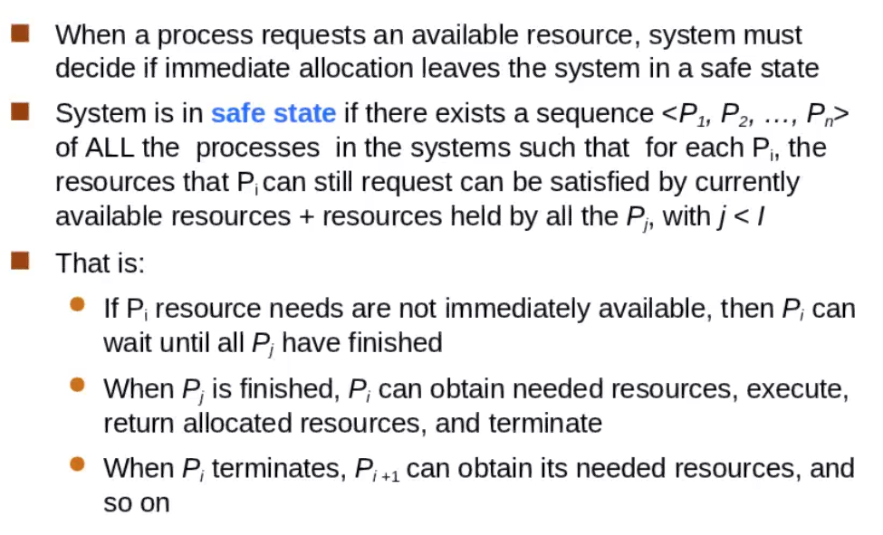
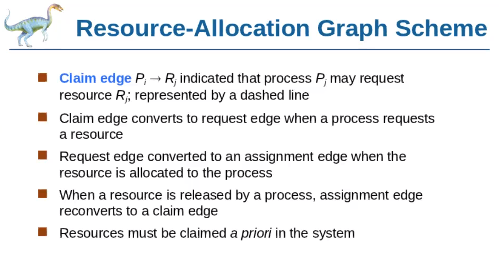
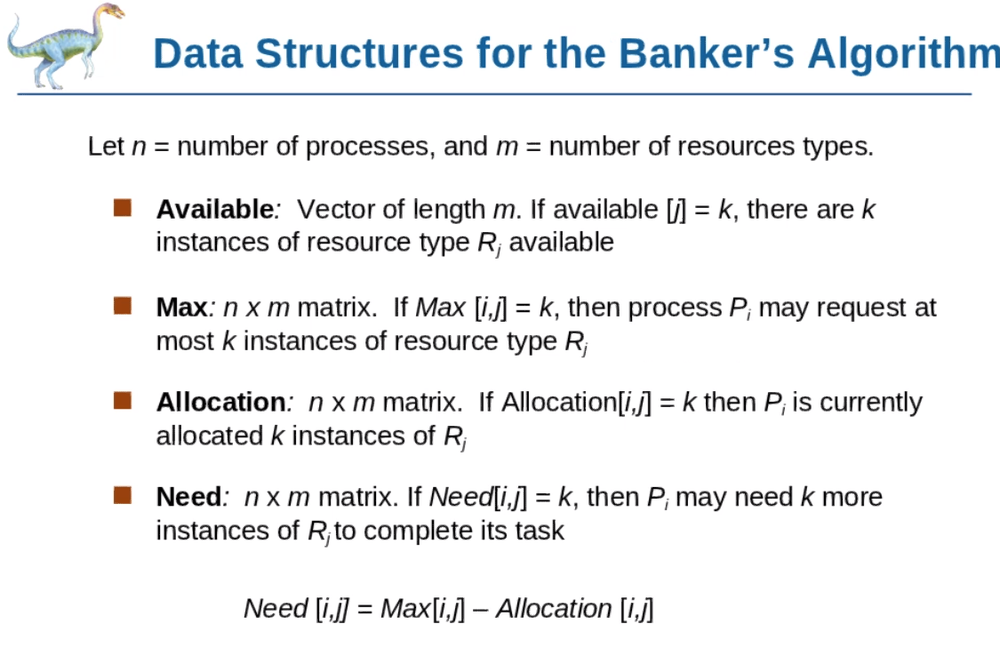
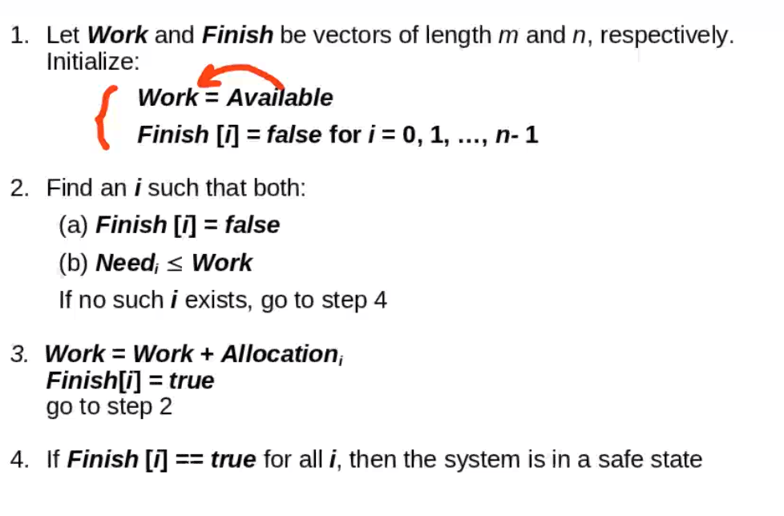
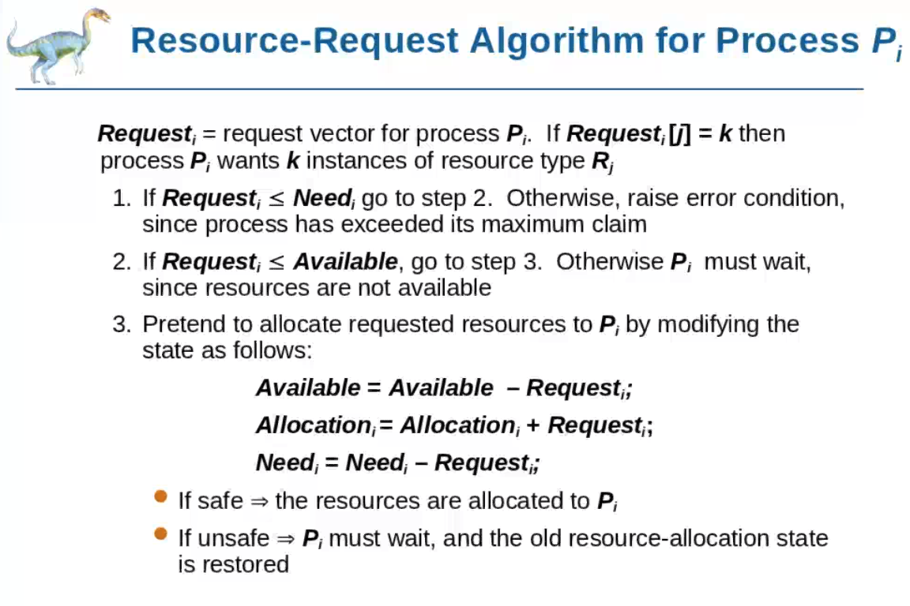

## Deadlock characterizacion
- exclusion mutua
- hold and wait
- no preemption
- circular wait

## Evitar deadlock

Antes de dar un recursos a un proceso, se asegura que no haya un deadlock

Basic Facts

- if a system esta en estaod seguro => no deadlock
- if el sistema no esta =>  pueda que haya deadlock

Hay que buscar una secuencia de procesos para que no se formen nunca ciclos, para evitar entrar en el modo INSEGURO

Vector Avaible, cada entrada es un tipo de recurso y el valor es la cantidad disponible

Max: Proceos i requeire k instnacias como maximo del recurso j

Allocation: proceso i tiene k isntnaicas asignadas del recurso del tipo j

Need: proceso j probablemente neceista k instnacias del tipo de recurso j

