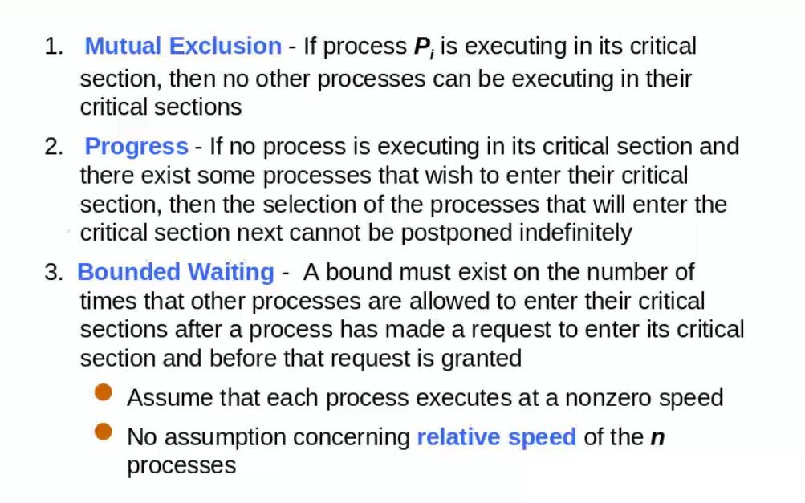
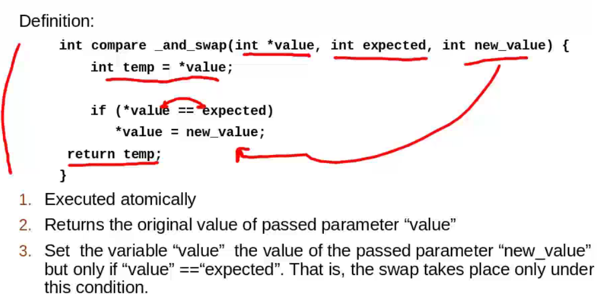
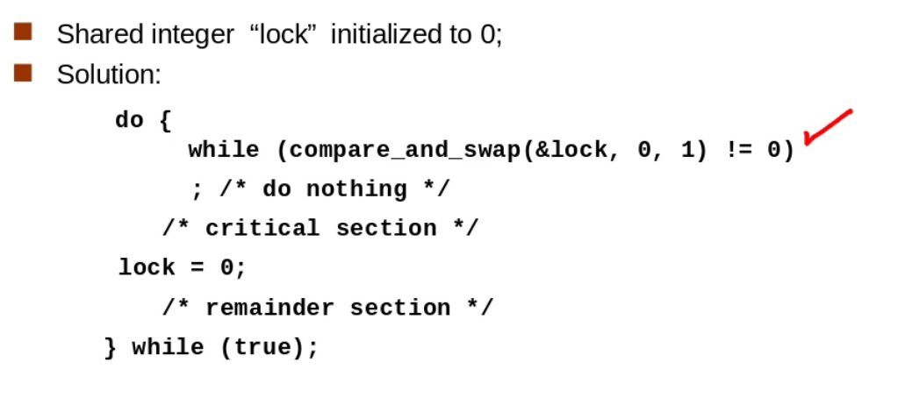
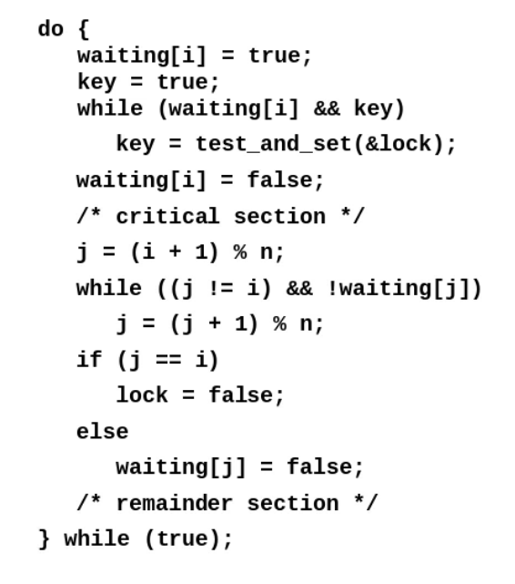

## Background

### Region critica

Bloque de codigo donde se trata de acceder a un recurso compartido

### Soluciones para critical

1. exclusion mutua, restriguen el acceso a otros prcoses 
2. progress, 
3. bounded waitign

### Critical Handling in OS

- preemptive permite que un proceos se apropie el CPU
- nonpreeemptive deja que un proceso se quede ejecutando hasta que lo dje por su cuenta

## Soluciones para region critica

### Peterson's Solution

- asume que las operaciones de carga y almacenamiento de datos son operaciones atomicas, no se interrumpen
se basa en exclusion mutua, es una solucion puramente algoritmica.

## Uso de candados

### Con `test_and_set`

`test_and_set` retorna lo que se le manda y setea lock con `TRUE`
por lo que los procesos que se ejecutan despues se quedan en el ciclo `while`

### Con `compare and swap`

Luego de `lock` ahora es 1, la funcion retona el valor original mandado, 0, el primer proceso pasa el `while`. Los demas procesos van a tenr a `lock` con valor de 1. Como 1 no es igual a 0 entonces el while se ejecuta y todos los otros procesos se quedan ejecutano el while. Estos salen cuando el priemro proceso ejecuta `lock = 0` y algun otro ejecuta `compare_and_swap` y podra salir del `while`

Pero la implementar la espera limitada se hace lo sigueitne

