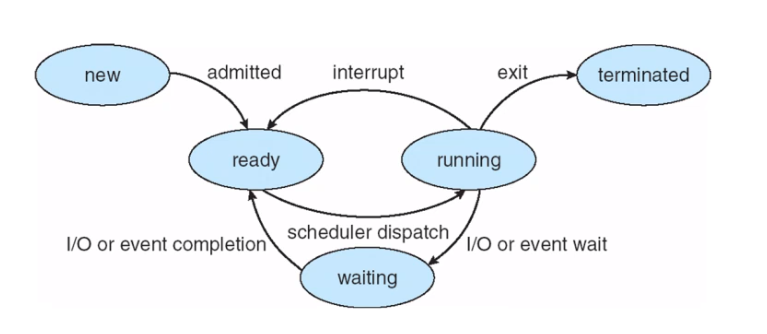
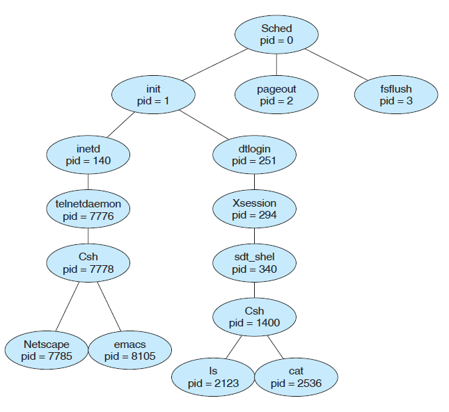

## Concepto del programa

El proceso del SO ejecuta codigo dle sistema, mientras que los procesos de usuario ejecutan codigo de usuario.

Un procesos es una esepecia de contenedor que nos permite llevar nuestras intrucciones al procesador para que sean ejecutadas.

Un programa solo es un archivo, un proceso se ejecutan de manera secuencial. es un bloque de memoria, se colocan las intrucciones (seccion de texto), program counter o puntero de intruccion (dice que intruccion ejecutar), en el STACK va las temproales, data par alas globales, las dianmicmente  (malloc, alloc, un obj creado) en el HEAP.

Conforme el proceso se ejecuta el uso de la memoria se va ocupando. El stack crece en direcciones hacia abajo, mientras que el heap crece para arriba.

Estados dle proceso (cambiadas por el SO):
- new: es creado
- running: esta ejecutada
- waiting: esperando por algun evento I/O
- ready: esperando pero listo para ser asignado al procesador
- terminated: ha terminado su ejecucion

Ciclo de vida de un programa



## PROCESS CONTROL BLOCK (PCB) o representado pro el task_strcuct

Tambine llamado task control block
Los datos se copian se tranformaicon/operan en el CPU y se devuelven a la RAM. Las variables ya no existen, solo son bloques de memoria

Informacion associeda con cada process
- process state: el estado del procesador visto anteriormente
- process counter: indica la direccion de la sigueinte intruccion a ser ejecutada por este proceso
- cpu register:  registros, incluyen accumlator, indices de registros, stack pointers
- cpu scheduling information: prioridad del proceso, punteros a colas de agendamiento y otros parametros de agendamiento
- memory managment information: informacion del valor de th abase y limite de registros, paginas o segmentos de tablas.
- accopunting information: esta informacion incluye la cantidad de CPU y real-time usado, tiempos limites, numeros de procesos y mas
- I/O statis information: aqui inluye lsita de I/O devices asignados al proceso, lista de archivos abiertos y mas.

El CPU sera "compartido" entre mucho procesos, en la practica se turnan el uso dle CPU

Cuando se itnercambian procesos siemrpe hay un tiempito de preparacion, cpu idle, y luego se carga los datos de PCB del otro proceso ahroa estan en el cpu

HILOS

Un programa tiene un solo hilo de ejecucion. Un hilo es algo que pertence al proceso, ene l PCB se manipula los hilos

``` 
struct task_struct {

  volatile long state;
  void ∗stack;
  unsigned int flags;

  int prio, static_prio;

  struct list_head tasks;

  struct mm_struct ∗mm, ∗active_mm;

  pid_t pid;
  pid_t tgid;
  unsigner int time_slice; tiempo del proceso en miliseg

  struct task_struct ∗real_parent;

  char comm[TASK_COMM_LEN];

  struct thread_struct thread;

  struct files_struct ∗files;

  ...

};
```

## Hilos


## Process Scheduling

Trata de maximizar el uso del CPU, cambiando rapidamente entre procesos.

El process scheduler (componente a veces compoente del kernel), este selecciona cual es el siguiente proceso a ejecutar:
- job queue: todos los procesos del sistema
- ready queue: estan en la memoria principal, listos y esperando para ser ejecutados
- device queue: procesos que esperan por dispositivos de i/o

Cuando un proceso esta ejecutando una de 3 puede pasar:
- el proceso espera por un i/o, puedo en I/O queue
- el proceso crea un nuevo subproceso y espera por el, donde espera?
- el proceso puede ser rmeovido forzadamente del CPU y como reusltado de una interrupcion y puesto ready queue


### Schedulers

- long-term scheduler o job shceduler, seleciona procesos del pool y los carga en la memoria para su ejecucion, menos ejecutado. solo cuando un proceso sale del ssistema, puede dmeorarse mas. Este debe hacer una decision muy cuidadosa. Este debe sleecionar un buen balance de procesos que requieren uso de i/o y de CPU
- short-term scheduler o CPU shceduler, selecion de los procesos cual era listo para ser ejecutado y le permite el uso del procesador. Este se ejecuta al menos una vez cada 100 milisegundos

Algunso sistemas incluyen un medium-trerm scheduler que se refiere al swapping

Estas son generalmente almacenados en una lista enlazada.
Una ready-queue cabecera contiene el pintero al primer y final PCB de la lista, cada PCB tiene un puntero al pcb del proceso que sigue en le queue
 los procesos se mueven entre las colas, no se repiten

## Cambios de contexto

El cambioo es guardar el estado del proceso, se guardan datos del PCBM REGISTROS, ESTADOS.

El kernel es quien se encarga de realizar el cambio de contexto, de guardar el proceso saliente y cargar el proceso entrante. el cambio de contexto es puro overhead, porque no se hace trabajo util mientras se cambia el contexto. El tiempo depende d ela velocidad de la memoria, la cantidad de registros y instrucciones generales, genralmetne poco milisegundos. En general dpende del hardware

La forma en que se conserva el espacio de direcciones y la cantidad de trabajo que se necesita para conservarlo depende del método de administración de memoria del sistema operativo.

## Creacion de procesos

Los procesos pueden crear otros procesos, se ordenan de formar de arbol. Se distinguen con un PID.
El proceso padre es el sched process, pid 0. Este proceso creae algunos proceso, inluyendo pageout y fsflush. Estos son los responsables de adminsitracion de memoria y file system. El sched proces tambien crea el init process. El cual sirve como padre de TODO los demas procesos. inetd -> networking (como telnet and ftp); dtlogin es el represenante de pantalla de logueo. Cuando el usuario se logeo, dtlogin crea un X-Windows session (XSession process) el cual crea sdt_shel process (command line shell o csh)



Cuando un procesos hijo es creado ahy dos psibildiades:
1. el padre continua su trabajo
2. el padre espera por el hijo

El espcio de direcciones de memoria:
1. el hijo es un duplicado de proceso padre
2. el hijo es un programa nuevo

La funcion `fork` retorna 0 en el hijo, y el pid en el padre. Normalente luego de `fork`, ejecutan un `exce` para cmabiar todo el PCB. Se puede usar `wait` para hacer que el padre espere por el hijo

## Terminacion de procesos

Un padre puede terminar un proceso hijo por:
- el hijo excedio lso recursos que han sido permitidos
- la tarea asinada al hijo ya no es necesario
- el apdre termino y el SO no pertmie hijo sin el padre

## Interprocess Communication

Un proceso de indepeneinte cuando no puede affectar o ser afectado por otro proceso.Cualquier proceso que no comparte data con otro, es independiente.

Un proceso puede ser cooperating, si puede afectar o ser afectado por otro proceso. Todo proceso que comparte data con otro proceso es cooperating process

Algunos de las azones para proveer la cooperacion entre procesos:
- compartir informacion: ej. usuarios que quieran una misma pierza de informacion
- computation speedup: si queremos compartir una tarea muy rapida, debemops dibidirla en subtarea.
- modularity: probablemente queremos construir el sistema en modulos, dividiendo funciones en procesos separados.
- conveniencia: un usuario puede estar trabajando en diferntes tarea

Metodos para comunicar:

- mensages: es util para pequeñas cantidad de data, no conflicts, es mas facil
- memoria compartida: mas rapido en ejecucion, no hay asistnecia del kernel para acceder a la memoria compartida

## Shared-Memory Systems

EL SO normalemne prevee que un proceso acceda a la informacion de otro proceso, para quitar esto se quiereten dos o mas procesos para remocer esta restriccion

## Mensajes

Usa la memoria del kernel, para enviar info. (No siempre es con el kernel)

Tipos:

- Naming: bajo comunicaicon directa, los procesos solo pueden: //Ej: sockets
  - tener un link esablecido automicamente entre cada par de procesos
  - un link es asocidado con solo DOS procesos
  - entre cada par de procesos solo existe un link

Se puede tener simetrica o asimetrica. La desventaja es la modularidad, cambios de el identificador of algunos de los procesos pueda que necesite examinar todos las otras definiciones de procesos. Todas las otras referencias de los antiguos identificadores seen ser encontradas. En general cualquier hard-coding tencia donde los identificadores deben que explicitos no son deseables

- Mailbox (puertos sualemtne son buffers en memoeria o discos duros), con comunication indirecta. variso procesos pueden compartir un solo mailbox. pero quien recibe depende de el esquema escogido:
  - un link permite estar asociedo con dos procesos a lo mucho
  - permite que un proceso ejecute recieve operation
  - permite que el system arbitrariamente escoga el procesoq ue resiva

Es indirecta porque es el mailbox donde se depositan los datos pero los procesos no lo ven hasta que se hace su ejecucion. Tal como un correo (emial)
El sistema permite crear nuevo mailbox, enviar y recibir a travez del mailboxy eliminar mailbox

### Sincronizacion

El paso de mensajes se puede hacer bloqueando o no bloqueante

- bloqueante al enviar: el enviador se bloquea hasta que el mensaje es leido
- bloqueate al recibir: el recibidor se bloquea hasta que haya algun mensaje para leer

- no bloqueante al enviar: el enviador envia y continua
- no bloqueante al recibir: lee lo que haya en el canal de comunucacion lleno o vacio y continua

### Buffering
- zero capcidad: la lista no puede tener mensajes en cola
- limitada: un numero lmite de mensajes
- ilimitada: sin limite de mensjaes

## Ejemplos de IPC System

### Memoria compartida

La memoria comaprtida se añade al espacio de direccione de memoria dle proceso o en algun otro lado, si los procesos no son adbyecntes a la moeria comaprtida, como se añade? queda como un salto?

(quien libera es memoria comapartida) Kernel(?)

Para crear un memoria compartida se usa:

```
segment id = shmget(IPC PRIVATE, size, S IRUSR | S IWUSR); // (key, SHMSZ, IPC_CREAT | 0666)
```

- el primer parametro es IPC_PRIVATE
- el segundo es el tamaño en bytes
- el ultimo indica el modo d ema memoria, lectura o escritoro o ambos
- retorna un id de la mmoeria compartida

Para unirse a una memoeria comaprtida se usa:

```
shared memory = (char *) shmat(id, NULL, 0);
```

- el primer parametro en el id de la memoria
- si el seugndo es NULL, el modo de operacion se asume que es para el USUARIO
- si pasamos 0, se permite lectura y escritura

Si todo sale bien, se retorna un puntero al comienzo de la memoria compartida

Una ejemplo para escribir en la memoria compartida es con:

```
sprintf(shared memory, "Writing to shared memory");
```

Para separarse de la memoria compartida se usa:

```
shmdt(shared memory);
```

Esto no elmina la memoria comaprtida del sistema, para eso se usa:

```
shmctl()
```

Al cual se le pasa el didentificador con la bandera IPC_RMID

### Matchs

Los mensajes son enviados y recibidos a travez de mailboxes llamados puertos.

Cuando se crean estas tareas se crean dos mailboes especiales:
- Kernel mailbox es usado por el kernel para comunicar con la tarea
- Kernel Notify mailbox

Solo se neceitan 3 llamadas al sistema para operar:
- `msg_sned` _ envia un mensjae al mailbox (port)
- `msg_recieve` se recibe el mensaje
- `msg_rpc` envia un mensaje y espera hasta una respuesta del enviador

Ademas se tiene la llamda `port_allocate` que crea un mailbox para alojar espacio en la cola de mensajes

Si el mailbox esta lleno pueden pasar 4 cosas:
- esperar indefinidamente
- esperar por n milisegindops
- no esperar y retornar inmediatamente
- cachear el mensaje y meterlo cunado se el mailbox tenga el espacio

Este sistema es diseñado principalmente para sistema distribuidos, pero tambien para sistema de un oslo procesador o MAC-OS.
El principal problema del Match es estar copiando el mensjae del enviadro al mailbox y luego al receptor. Para esto tiene tecnicas de un admitrador de memoria virtual para evitar estar copiando dos veces. EN resuemn Match mapea el espacio de direccion que contiene el mensje del envuiador en el especio de direccion de receptor. **El mensaje en si nunca es copiado**
