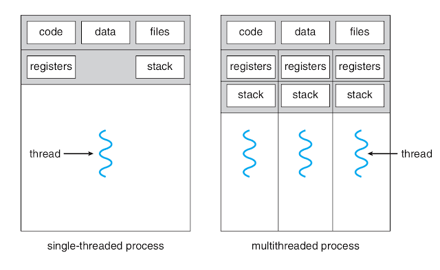
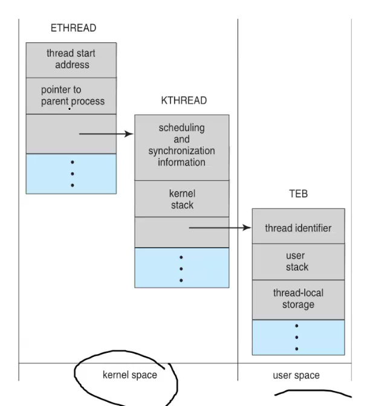

## IPC System - Windows

Puertos

## Sockets

Hay que conocer la direccion y puerto del otro computador, los puertos son identificador que le dice al SO y servidor que espera el cliente

# Hilos
Son una unidad basica de CPU de utilizacion. Este tiene un Thread ID, program counter, a register set, y un stack. Este comparte con otros hilos, code section, data seection, y otros os recursos como files y señales. Un proceso tradicional tiene un solo hilo de control. Si un procesos tiene mas de un hilo de control puede hacer mas de una tarea al mismo tiempo.

## Beneficios
- Responsiveness: permite que el programa siga corriendo apesar de que una aprte de el se bloquee
- Resource sharing: los procesos comparten recursos con M.S. o messasing passing. MIentras que los hilos comparten recursos del mismo proceso, usando un solo espacio de memoria.
- Economy: asignacion de meoria y recuersos para un proceso es costoso, como el hilo copmaprte los recursos dle proceso, es mas eficiente que crear un proceso totalmetne nuevo. es mucho mas costoo crear y adminsitrar un proceso que un hilo. en Solaris cerar un proceso es 30 veces mas lento que un hilo
- Scability: permite correr ne mucho nucleos, cores.

Retos de la programacion multicore:
- dividir actividades: examinar la spalicaciones para encontrar areas que pueden dividirse, tareas concurrnetes y entonces corren en paralelo.
- balance: cada tarea creada para los hilos debe ser balaceada en trabajo y valor. 
- dara spliting: el acceso a la dara y manipulacion de las tareas debe ser dividida para correr en mucho cores
- data dependecy: tareas donde un depenede de lso datos de la otra debe asegurarse que las tareas estan synconizadas para acomodar la dependencia
- testing y debbuging: como el programa corre en mucho hilos es mucho m as dificil encontrar los bug en un programa corriendo.

## Modelos de multithreanding

### Many-to-One
Muchos hilos del usuario son mapeados a un solo hilo del kernel. La administracion del hilo es relaizada esde el user space, esto es eficiente pero si un hilo hace una llamda bloqueante, todo el proceso se bloqueara. Como solo un hulo (el del kernel) corre, entonces los hilos de usuario no pueden correr en paralelo en cores

## One-to-One
Mapea cada hilo de usuario a un hilo en el kernel, esto permte courrencia y los hilos no se bloquean si alguno otro realiza un llamda bloqueante. La creacion de un hilo aqui requere tambine la creacion de hilo del kernel, la creacion de un hilo de kernel puede quemar el rendimiento Linux y Winwos implemntat el one-to-one.

## Many-to-many
Mapea muchos hilos de nivel usuario a menos o igual cantidad de hilos kernel. La cantada de lso T.K. puede ser explicita en la aplicacion o por maquina. Mientras que en el modelo many.to-one la concurrencia no es garantizada, el modelo one-to-one garantiza mas concurrencia, pero tiene que tener cuidado de no crear muchos hilos en una applicacion. Pero este modelo many to many no sufre de esto porque el usuario puede cerar muchos hilso y los correspodnitnes hilso del kernel corren en paralelo, si un hilo se blqouea, el kernel crea otro para seguir con la ejecicion

## Librerias de Hilos
Nos permiten crear y adminsitrar hilos, es una API. Hay dos maneras proveer una libreria entramente que esiste en el user sapce, invocar una funcion reuslta en una funcion local en el user space y no llamda al sistema. EL otro enfoque es crear una kernel-level library,  el codigo y estrutura de datos para la libreria resultan en una llamada al sistema al kernel. POSIX puede ser provida como user o kernel library. Win32 es una librerua de kenrel, The Java thread permite hilos creado y admintrados directamente en programas de Java, Sin embargo, java como es una maquina virtual, depende del SO. Si esta en windows es una libreria de kernel usando Win32, pero si esta en Linux usa Pthread

## OMP
Macro para crear hilos

# Grand Central Dispatch
^{} mete en las colas trozos de codigo. todos compiten por ejecutarse. pero mi codigo rpinciapl sigue de largo

## Threading Issues
Si un hilo llama a fork(), dpendiendo dle SO, puede duplicar todos los hilos o solo duplica el hilo que incoo a fork().

Si un hilo llama a exec(), el programa invocado en exec() reemplazara todo el proceso actual incluyendo todos los hilos. Si exec() es llamda inmediatameente despyes de fork(), entonces la duplicancion de hilos es incesaria, el programa reemplzara todo. Pero si no llama a exec() despues d efork(), el procesos separado debera duplicar todos los hilos.

## Cacelacion

- asyncona: un hilo inmediatame termina a un hilo en especificop
- deferred: el hilo objetivo chequea periodiacamente si deberia terminal, si es el caso el mismo se mata, F. COn pthread_kill o kill? el hilo seguira su ejecucion hasta llegar el pthread_testcancel. esto cuando los hilos trabajan en datos compartidos entre ellos

pthread_kill es una señal que el hilo la recibe, se configura el tipo de cancelacion en los atributos cuando se crea el hilo.

El problema viene cuando un hilo esta actualizando data comparitda, el SO reclama lso recuross pero aveces no todo. entocnes una canclacion asincrona no neceariamente libera todos los recursos. Mientas que la deferred el hilo puede calcear de manera segura.

## Manejo de señales

- sincrona, cuando un hay acceso a la meonoria no eprmitido o division para cero, la señal es entregada al mismo proceos que la genero.
- asiuncrona es cuando un angete externo genrea la señal, como ingrresar Ctrl+C, tipicamente el selal es enviada a otro proceso.

Estas señales pueden ser manjeadas tanto por un manejador por defecto o uno definido por el usuario. Las que son por defecto son manejds por el kernel cuando son generadas. 

En programas de un solo hilo las señales son enviadas a ese proceos con ese hilo, pero en programas con multiples hilos ocurre alguna de estas:
- es entregado al hilo quien aplico al señal
- es entregado a todos los hilos
- es entregado a ciertos hilos
- se asigna un hilo especifco para recibir todas las señales

Si es una señal sincrona, esta necesta ser entregada al hilo que la causo, pero esto cambia cuando es asincrona como Ctrl+C. por lo tanto en algunao casos es entrafa a los hilos que no la estan bloqueando, peroc omo se debe manejar una vez, se la entrega al primer hilo que no la bloquee.

## Thread-Local Storage
permite tener bloques de memoria aun cuando el hilo termina.

## LWP

Lightwieght proicess, por cada lwp se tiene un hilo de kernel. Entonces todo se reduce como se mapea los hilos de usuario al hilos del kernel a traves del lwp

> Nº Hilos usuarios >  Nº LWP

CADA HILO TINEE ID, REGISTRO SET, SEPARATE USER AND KENEL STACKS

Windows
- ETHREAD contiene un puntero al proceso padre,
- KTHREAD planificacion sincroniczaicon de kernel
- TEB tiene inofmracion de stack user mode

## Linux Threads
Para linux todos son tareas
Se usa clone() para decirle que creer una tarea que vive en el espacio de memoria

