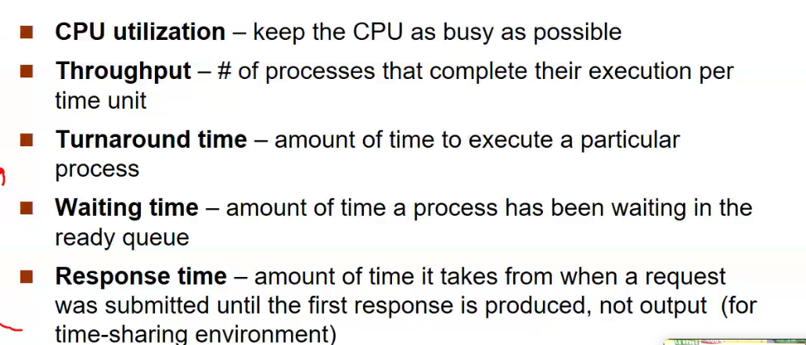
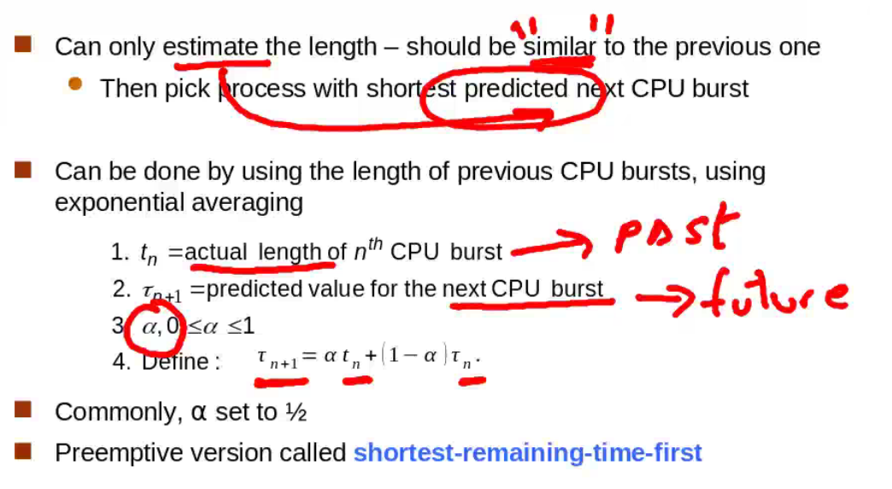
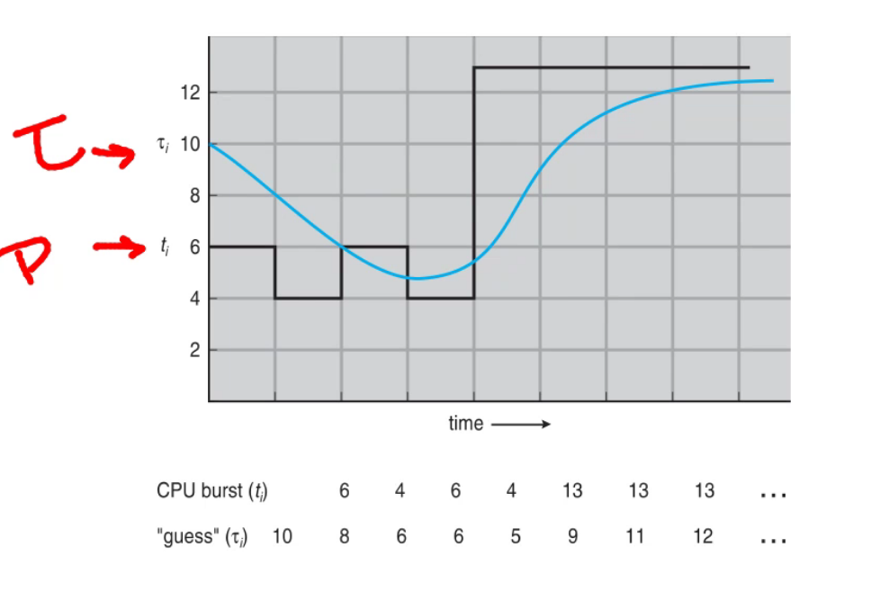
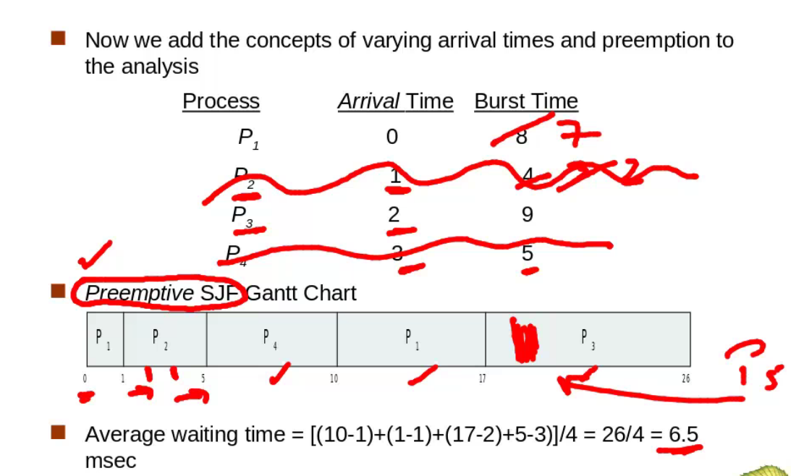

## CPU Scheduling
Maximizar el uso del CPU obtenido con multiprogrmacion

Tiempo de despacho, prepracion, no hace tiempo util

- CPU-IO Burst uso de entrada y saldia
- CPU busrt uso solo del cpu

Busrt es el tiempo, suelen ser de 5 milisegundos, erores pueden ser mas

CPU-S o short-term scheduler toma deciciones cuando:
1. cambia de running a wait. son no apropiativos, cede el uso el mism proceso. Ej: resultado de I/O request o invocacion de `wait`
2. cambia de running a ready state. son apropiativos, hay un tercero que decido que pasa cone l uso de cpu. el SO puso el temp y el temp termino y el so quita al procesador. Ej: ocurre una interrupcion
3. cambia de wait a ready state. el SO decide ahora le toca a otro proceso. son aprpiativos. Ej: completacion de I/O
4. termina un proceso. son no apropiativo, dele el uso el mismo procesador

La mayoria son apropeitivos, el SO chequea como distivuir el uso del CPU. 

la latencia de despacho (dipach) tiene que ser muy pequeña para que no afecte el rendimiento dle sistema.
Los SCHEDULER son relativamente sencillos, para que l tiempo d electura y escritura sean RAPIDOS

- cpu utilization ++
- throughput: numero de proceos que se ejecutan por segundo ++
- turnaround time: cantiadad de tiempo de un proceso en particular --
- waiting --
- response tiem: interfaz grafica tiempo de respuesta de nuestro programa. Scheduler cuando arga un proceso se pueda interactuar con el --

## First-Come, First-Served (FCFS) Scheduling
Convoy effect - todos lso rpocesos se atrasan por el proceso que esta primero y es lento.

## Shortest-Job-First (SJF)
Cada proceso tiene que decirnos cuando va a durar su burst
Este da el menor tiempo promedio de espera

tn = es la longitud real, la que existió, del n-egsimo bust dle CPU. ESTO PASADO

(tau)n+1 = prediccion de valor del sigueinte busrt

(alfa) = entre 0 y 1

Define: (tau)n+1 = (alfa)tn + (1-(alfa))(tau)n

(tau) y tn NO necesriamente son IGUALES

Ejemplo de una prediccion

Si se pone (alfa) como 0 se toma solo la prediccion mia, si se pne 1 solo se toma lo que en realidad paso en le pasado. (alfa) puede cambiar y ser un vlaor en funcion de otra cosa como el error

## Shosrtes-Remaing-Time-First

Si un prcoeso aparece y itnee menor burst que tiempo remanente que el que se esta ejecutando, este procesos nuevo entra al CPU

## Priority Scheduling

- un numero de prioridad (int) is asociedo con cada proceso
- el cpu es asignado al proceso que tiene una prioridad mas alta (menor int === alta prioridad)
  - preemptive
  - nonpreemptive
- SJF es agendador de prioridad donde prioridad es inveresa de siguiente burst time
- problem === starvation - proceoss de baja prioridad puede ser nunca ejecutado
- solution === aging - con el tiempo la prioridad del proceso se la aumenta

## Round Robin (RR)

Define quantum detiempo (q). A cada proceso se le un quantum de tiempo y le permitirmos que se ejecute q unidades de tiempo, si termina bine, si no no importa, se lo saca. Cada q unidades de tiempo se cambia entre procesos y se llama al agendador.

Cada proceso en la practiva, recibe 1/n. lo maximo que espera un proceso (n-1)*q. La variable q esta en el orden de los milisegundos. Si q es muy grande, esto se convierte FIFO, Si q es muy pequeño es similar al tiempo de cambio de contexto o despacho, pueda que se dmeore la misma cantiada de tiempo despachando que haciendo trbajao util

Los cmabio de contexto estan en el orden de los microsegundos