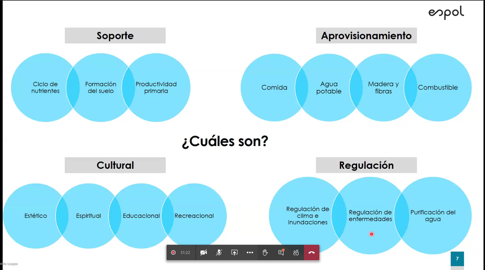

## Biogeografia
Identificar los patrones espaciales y temporales de la distribuicion de los seres vivos sobre el planeta ha sido desde el comienzo el centro del estudio de la biogeografia.

### Teorias gradientes de diversidad
- clima: favorables para que mas especies coexistan
- estabilidad climatic: los climas estables permiten la especiacion
- productividad: la diversidad se limita por la cantidad de energia disponible
- historia evolutiva: mas tiempo permite mayor especiacion
- heterogeinidad espacial: habitats mas complejos, proveen mas nichos y permiten la coexistencia de mas especies
- competencia: favorece nichos pequeños y pueden llegar a extiguir especies

Hostpot: debe tener al menos 1500 plantas vasculares como endemicas, irremplazable. 30% de su poblacion original, amenazado

## Poblacion

### Parametros que afecta al su tamaño
- natalidad, N
- mortalidad, M
- emigracion, E
- inmigracion, I

la taza de crecimiento es la suma de ingresos menos la suma de los egresos: dN/dt = ([Nacimientos + Inmigracion] - [Muertes + Emigracion])/dt

### Estructura etaria

- la poblacion se expande si estna por arriba de la FNR, triangular
- si los aultos en edad reproductiva tienen justo el numero de hijos ncesarios para reemplazarlos, la poblacion esta en FNR, suecia
- la poblacion se encoge cuando lso adultos tienen menos hilos, se estreecha en la base, Italia

## Factores que afectan tasa de natalidad y fecundidad
- La importancia de los niños como parte de la fuerza laboral.
- El costo de criar y educar a los niños
- La disponibilidad o falta de sistemas de pensiones públicos y privados.
- Las oportunidades educativas y laborales disponibles para las mujeres.
- La edad promedio al contraer matrimonio.
- La disponibilidad de métodos anticonceptivos confiables.

### Cómo podríamos disminuir el crecimiento poblacional
- Empoderar a las mujeres (IGUALDAD DE GÉNERO)
- Promover la planificación familiar

### Avances aumenten capacidad
- grandes avances indistriales y medicos permiten una explosion poblacional
- avance medico redice la mortalidad
- descubirmiento de bacterias y su papel en las infeccion
  - mejor control de enfermedades
  - uso de antibioticos
  - las vacunas para enfermedades como la viruela redicen las muerten

## Sistemas Ecosistemicos

